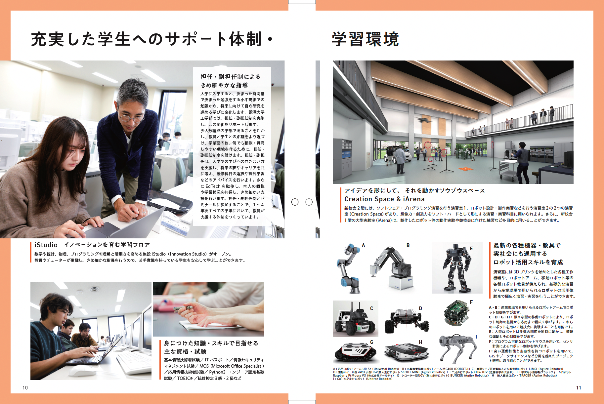
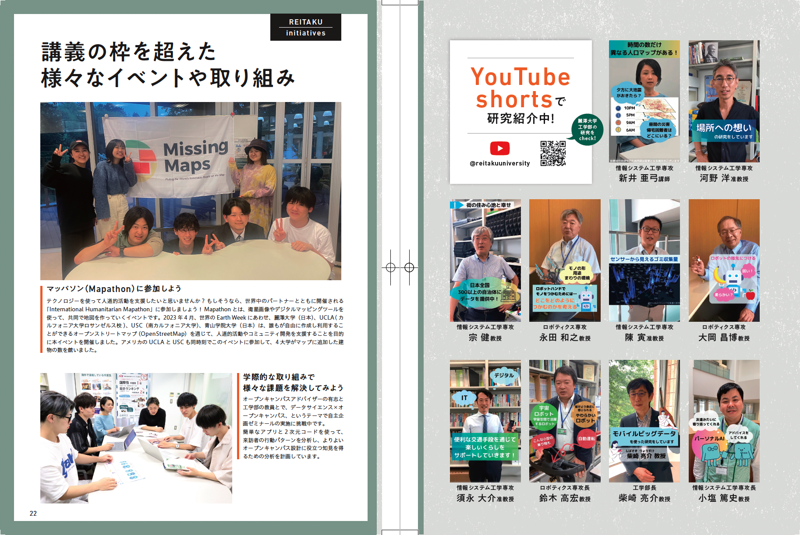

# 

<xlarge>

統計学 **A** **B**

</xlarge>

Week 1 
# Hello! Again?

##

##

##

#

## Meet your classmates

# Join the class!

#### Step 1

### Step 2

<xlarge>
c2lxztb
</xlarge>

# Textbook｜教科書

【タイトル】
プレステップ　統計学Ⅱ
：推測統計学

【著者】
稲葉由之

【発行社】
弘文堂

【定価】
1980円

教科書は必ず購入してください。

## Schedule スケジュール

Week | Ch |Topic 
:--|:--|:--
Week 1 | Ch2 | 記述統計学の復習
Week 2 | Ch1 | 母集団と標本
Week 3 | Ch3 | 確率と確率変数
Week 4 | Ch4 | 確率分布
Week 5 | Ch5 | 大数の法則
Week 6 | Ch6 | 中心極限定理
Week 7 | Ch7 | 正規分布とカイ二乗分布

###
Week | Ch | Topic
:--|:--|:--
Week 8 | Ch8 | 母数の点推定
Week 9 | Ch9 | 母平均の区間推定
Week 10 | Ch10 | 母分散の区間推定
Week 11 | Ch11 | 統計的仮設検定
Week 12 | | 試験対策①
Week 13 | | 試験対策②
Week 14 | | 試験対策③
期末試験 ||  日程は別途広報します

## Grading｜成績評価

- 毎週出席（14回） 40%
- 毎週課題（11回） 30%
- 期末試験 30%
- $$(1400*\frac{1}{14}*0.4)+(1100*\frac{1}{11}*0.3)+(100*0.3)=100$$

    - クラスの平均点，標準偏差等によっては，合計調整を行いま
    - 出席率60%以上で評価対象となります
(大学全体と同様)</small>

# 第2章　統計的記述の基礎

## 統計データの分類

### 名義尺度
区別することができる

### 順序尺度
順序をつけることができる

### 間隔尺度
足し算、引き算をすることができる

### 非列尺度
かけ算、割り算をすることができる

## 離散変数と連続変数
discrete variables and continuous variables

## 相対度数と累積相対度数

relative frequency and cumulative relative frequency

###

## 平均値と分散、標準偏差

### 平均 average

$$\overline{x}=\frac{1}{n} \sum_{i=1}^{n} x_{i}=\frac{1}{n}\left(x_{1}+\cdots+x_{n}\right)$$

### 分散 variance

一つの変数の平均からの散らばりを統計的に図る

 

$$
s^2_x = \frac{1}{n}\sum_{i=1}^n(x_i-\overline{x})^2
$$

### 標準偏差 standard deviation

標準偏差は分散の平方根である
 

$$s_{x} = \sqrt{\frac{1}{n} \sum_{i=1}^N (x_i - \overline{x})^2}\$$

## 相対度数を用いた平均値と標準偏差の計算
Calculating the mean and standard deviation from a frequency distribution

### 

### 

###

###

###

# Next week

##

