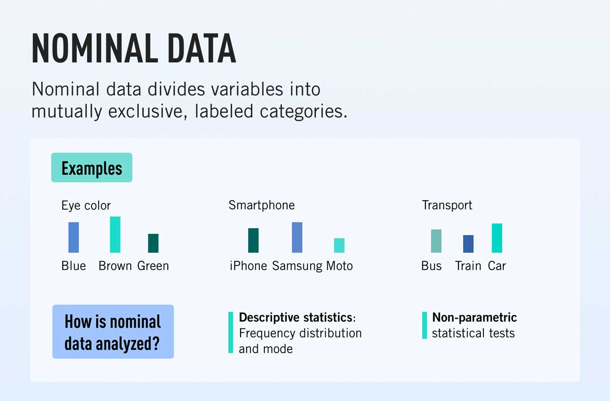

# 

<xlarge>

統計学B

</xlarge>

Week 1 | April 18, 2023

# Welcome.
 
 
 
 
 
 

# Hello!

#

## Call me "Yoh"

## 

[My journey](https://yohman.github.io/21S-DH151/Weeks/Week01/misc/me.html)

##

##

##

# Your turn! | あなたの番

- your name | 名前
- your passion | 最近ハマってるもの
- your research interest | 研究するとすればこんなことやってみたい

## My teaching philosophy 私の教育哲学
### 1: class = community

### 2: it's a two way street

Source: LA Times

### 3: sharing is caring

[Source: CDTA Law](https://cdtalaw.com/cdta/the-importance-of-sharing-knowledge-in-any-legal-context/)

# Join the class!

#### Step 1

### Step 2

# Textbooks｜教科書

##

【タイトル】
プレステップ　統計学Ⅱ
：推測統計学

【著者】
稲葉由之

【発行社】
弘文堂

【定価】
1980円

教科書は必ず購入してください。

## Schedule スケジュール

Week | Ch |Topic 
:--|:--|:--
Week 1 | Ch2 | 記述統計学の復習
Week 2 | Ch1 | 母集団と標本
Week 3 | Ch3 | 確率と確率変数
Week 4 | Ch4 | 確率分布
Week 5 | Ch5 | 大数の法則
Week 6 | Ch6 | 中心極限定理
Week 7 | Ch7 | 正規分布とカイ二乗分布

###
Week | Ch | Topic
:--|:--|:--
Week 8 | Ch8 | 母数の点推定
Week 9 | Ch9 | 母平均の区間推定
Week 10 | Ch10 | 母分散の区間推定
Week 11 | Ch11 | 統計的仮設検定
Week 12 | | 試験対策①
Week 13 | | 試験対策②
Week 14 | | 試験対策③
期末試験 ||  日程は別途広報します

## Grading｜成績評価

- 毎週出席（14回） 50%
- 毎週課題（10回~14回） 30%
- 期末試験 30%

<small>*出席率60%以上で評価対象となります
(大学全体と同様)</small>

##

<large>
第2章　統計的記述の基礎

##

## 名義尺度

## 順序尺度

## 間隔尺度

## 非列尺度

### 平均 average

$$\overline{x}=\frac{1}{n} \sum_{i=1}^{n} x_{i}=\frac{1}{n}\left(x_{1}+\cdots+x_{n}\right)$$

### 分散 variance

一つの変数の平均からの散らばりを統計的に図る

 

$$
s^2 = \frac{1}{n}\sum_{i=1}^n(x_i-\overline{x})^2
$$

### 標準偏差 standard deviation

標準偏差は分散の平方根である
 

$$s_{x} = \sqrt{\frac{1}{n} \sum_{i=1}^N (x_i - \overline{x})^2}\$$

### 変動係数 Coefficient of Variation

分布の拡がりを表す統計量

標準偏差を平均で割る

$$
C.V. ={\frac{S_x}{\bar{x}}} 
$$

## 標準化とZ得点

##

<latex>

$$ Z得点 = \frac{x_i - \mu}{\sigma} $$

</latex>

## 

このクラスの平均身長
165cm(μ)
標準偏差
7cm(σ)
先生の身長は177cm ➡︎ 標準化すると？

##

<latex>

$$ 
\begin{aligned}

先生のZ得点 
&= \frac{177 - 165}{7} \\
&= 1.71 

\end{aligned}

$$

</latex>

### 共分散 covariance

二つの変数の平均からの散らばりを統計的に図る

 

$$
s_{xy} = \frac{1}{n}\sum_{i=1}^n(x_i-\overline{x})(y_i-\overline{y})
$$

### 相関係数 correlation
標準化した共分散の値

 

$$\begin{align*} r &= \frac{s_{xy}}{s_xs_y} \\[5pt] &= \frac{\frac{1}{n}\sum_{i=1}^n(x_i-\overline{x})(y_i-\overline{y})}{\sqrt{\frac{1}{n}\sum_{i=1}^n(x_i-\overline{x})^2}\sqrt{\frac{1}{n}\sum_{i=1}^n(y_i-\overline{y})^2}} \end{align*}$$

##

この計算だと、**相関係数**は必ず

-1 から +1

の間の数値になる

##

<table>
<tr class=gray>
<th>相関係数rの値</th><th>相関</th>
</tr>
<tr>
<td>

$$ 
-1\hphantom{.0} \leq r \leq -0.7
$$

</td>
<td>
    強い負の相関
</td>
</tr>

<tr>
<td>

$$ 
-0.7 \leq r \leq -0.4
$$

</td>
<td>
    負の相関
</td>
</tr>

<tr>
<td>

$$ 
-0.4 \leq r \leq -0.2
$$

</td>
<td>
    弱い負の相関
</td>
</tr>

<tr>
<td>

$$ 
-0.2 \leq r \leq \hphantom{-} 0.2
$$

</td>
<td>
    ほとんど相関がない
</td>
</tr>

<tr>
<td>

$$ 
\hphantom{-}0.2 \leq r \leq \hphantom{-}0.4
$$

</td>
<td>
    弱い正の相関
</td>
</tr>

<tr>
<td>

$$ 
\hphantom{-}0.4 \leq r \leq \hphantom{-}0.7
$$

</td>
<td>
    正の相関
</td>
</tr>

<tr>
<td>

$$ 
\hphantom{-}0.7 \leq r \leq \hphantom{-}1\hphantom{.7}
$$

</td>
<td>
    強い正の相関
</td>
</tr>
</table>

# Assignment | 今週の宿題

Fill out [this survey](https://forms.gle/UZkTDh2GcSj1WjXZA)
この[サーベイ](https://forms.gle/UZkTDh2GcSj1WjXZA)を提出

水曜日の夜11時59分まで

# Next week

第2章：統計データの分類（pp.18-30）

