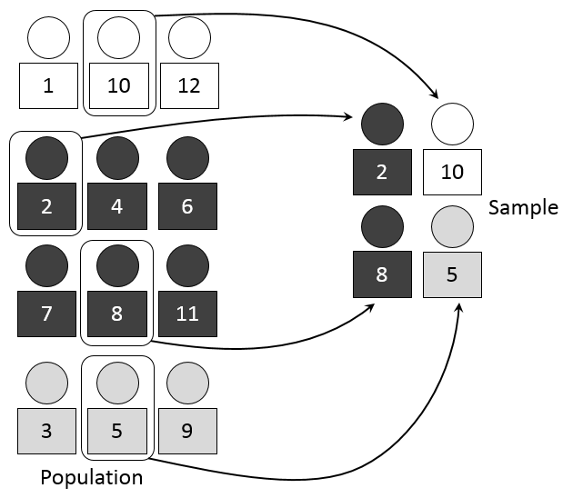
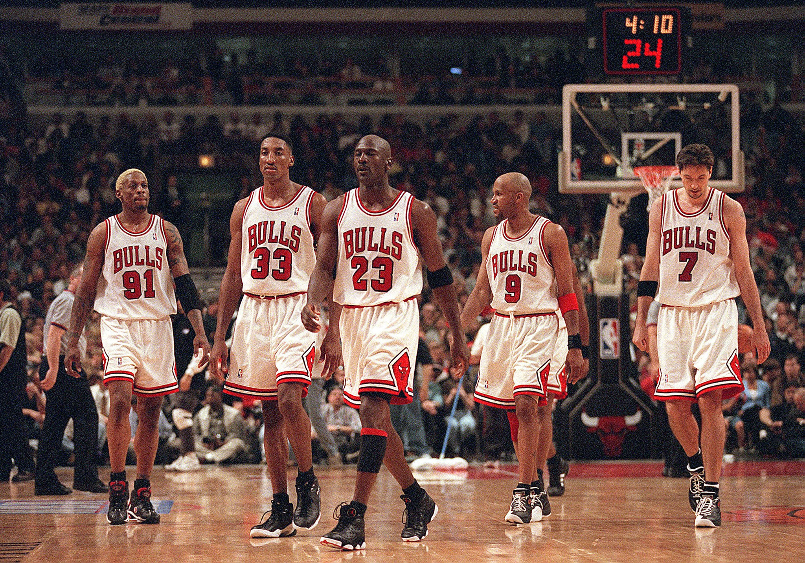

# 

<!--  -->

<xlarge>

統計学B

</xlarge>

Week 2

#

<large>

母集団と標本

</large>

Population and sample

# p8

#

<xlarge>
Bias ➡︎ ❌

#

[Can Twitter Save Lives?](https://www.youtube.com/watch?v=2gdl6dKNITQ&ab_channel=TEDxTalks)

#

#

#

#

#

#

#

#

#

#

#

#

#

#

#

#

#

#

#

#

Is there bias in my research sample?

# 母集団と標本の定義

##

<small>

[image source](https://www.researchgaps.com/existing-sample-size-guidelines/)

</small>

## Is this a good sample of the population?

<small>

[image source](https://www.linkedin.com/pulse/why-sampling-important-vithika-agrawal)

</small>

##

<large>母集団（population）</large>

対象とする集団（個人、世帯、企業…）全体

<large>標本（sample）</large>
母集団の一部

#

Why do we need a <plum>sample</plum>?
なぜ<plum>標本</plum>が必要なの？

#

Because it is impossible to survey the entire population

対象すべてに調査をすることが不可能であるため

## （１）標本から母集団を推し量る

#

#

#

#

#

## クイズ1-1 (教科書p. 8)

適切な調査対象はどれでしょう？

<plum>ポイントは標本が母集団の特徴を表現しているかどうか

<left>

<gray>A</gray>	大学の講義の休み時間を利用して学生に調査票を記入してもらう

<gray>B</gray>	混雑していない時間帯の来店者に調査票を渡して店舗内の机で記入してもらう

<gray>C</gray>	ポイントカードの利用履歴から平均して1週間で1回以上来店している人を抽出して調査票を郵送する

## クイズ1-1 (教科書p. 8)

<plum>標本としてなんでダメなのかを理解するのが重要

<left>

<gray>A❌</gray>	大学の講義の休み時間を利用して<plum>学生に</plum>調査票を記入してもらう

<gray>B❌</gray>	<plum>混雑していない時間帯の来店者</plum>に調査票を渡して店舗内の机で記入してもらう

<gray>C⭕️</gray>	ポイントカードの利用履歴から平均して1週間で1回以上来店している人を抽出して調査票を郵送する

## （２）母集団の例

##

<gray>有限母集団・finite population

母集団の規模を確定できるもの（例：麗澤大学生の平均身長）

<gray>無限母集団・infinite population

母集団の規模が無限または不確定であるもの（例：世界の人の平均身長）

<gray>枠母集団・frame population

標本を抽出するために設定した母集団

##

##

##

##

##

##

## （３）母集団の解釈

##

##

##

## （４）母数の定義と表記法

### 母数（パラメータ：parameter）

<medium>母集団の状況を表す統計数値

<medium>母集団の平均値や分散など

<small>実は統計学基礎で計算した平均や分散などは【パラメータ】と呼ばれるもの
</small>

### よく使う母数（パラメータ）

母平均		：<plum>$𝜇$</plum>	（ミュー）
母分散		：<plum>$𝜎^2$</plum>	（シグマの2乗）
母標準偏差	：<plum>$𝜎$</plum>	（シグマ）
母相関係数	：<plum>$𝜌$</plum>	（ロー）

# 標本の抽出

## 標本の抽出方法

- 全数調査（悉皆調査）Census
  - 母集団すべてに行う調査
- 標本調査 Sample survey
  - 標本を抽出して、標本のみに行う調査
- 標本抽出 Sampling
  - 母集団の一部を取り出すこと
  - the *process* of selecting a sample
- 無作為抽出 Random sampling
  - ランダムな抽出方法
  - a *method* of selecting
    - ランダム	：作為的でない、法則性がない
    - each member has an *equal* chance of being chosen

## 標本の抽出方法

## 標本の抽出方法

## random sampling

## systematic sampling

## stratified sampling

## cluster sampling

##

##

##

##

# Review

# Is there <red>bias</red> in my research sample?

##

# 第1章のまとめ

- 母集団と標本
  - 母集団（対象とするすべての事物）
  - 標本（母集団の一部）
- 母集団
  - 無限母集団（母集団の規模が不明、無限）
  - 有限母集団（母集団の規模が確定できる）
- 母数（パラメータ）
  - 母集団の特徴を表す統計数値（平均、分散など）
- 標本の抽出
  - 無作為抽出（ランダムに選ぶ）