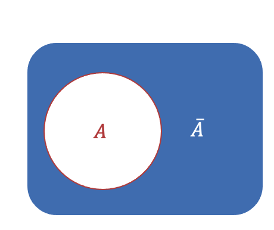
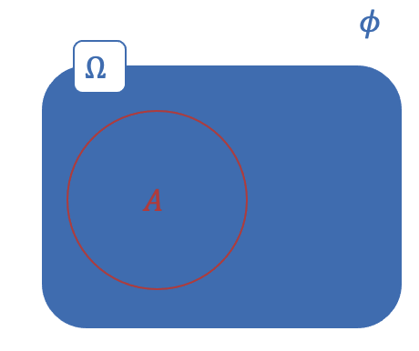
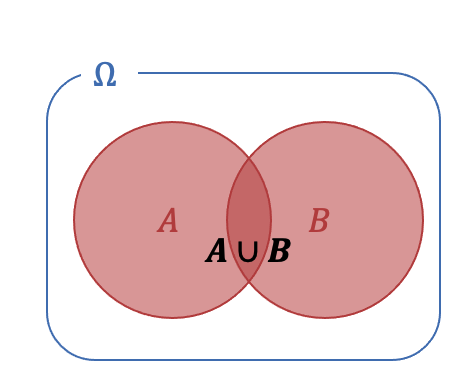
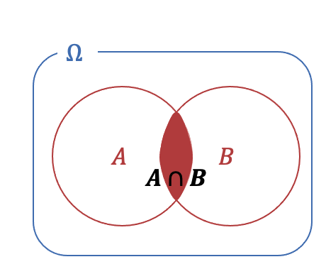
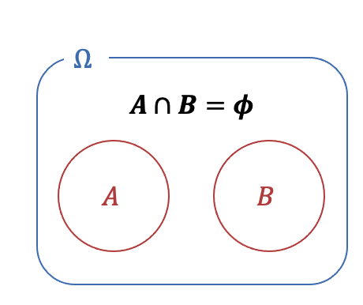

# 

<xlarge>

統計学B

</xlarge>

Week 3

#

<large>

確率と確率変数

</large>

# （１）確率に関する諸定義

##

- 確率
  - 偶然性の確からしさを測る指標

- 事象
  - 偶然性を伴って生じる結果
    - サイコロを投げて「2」の目が出ること
    - コインを投げて表が出ること

### 例）	事象A：	コイン投げで「表」が出ること

- 余事象 complementary event
  - 事象<gray>A</gray>が起こらないこと
  - 事象<gray>A</gray>の補集合
    - コイン投げで「裏」が出る
    - <gray>$\bar{A}$</gray> ={裏}

### 例）	事象A：	コイン投げで「表」が出ること

- 全事象（標本空間）universal set
  - 起こり得る結果すべて
    - <gray>Ω={表, 裏}

- 空事象 empty set
  - 事象が何も起こらないこと
    - <gray>𝜙 （ファイ）

##

**事象A：	コイン投げで「表」が出ること**
**事象B：	コイン投げで「裏」が出ること**

- 和事象 <eng>union set</eng>
    - 事象Aまたは事象B
    - 事象Aと事象Bの少なくとも1つが起こること
      - 表か裏のどちらかが出ること
      - <gray>𝐴∪𝐵

##

**事象A：	コイン投げで「表」が出ること**
**事象B：	コイン投げで「裏」が出ること**

- 積事象 <eng>Intersection set</eng>
  - 事象Aかつ事象B
  - 事象Aと事象Bがともに起こること
    - 表と裏の両方が出ること
    - <gray>𝐴∩𝐵

##

**事象A：	コイン投げで「表」が出ること**
**事象B：	コイン投げで「裏」が出ること**

- 排反事象 <eng>Mutually exclusive events</eng>
    - 積事象が空事象であること
      - <gray>𝐴∩𝐵=𝜙
      - 表と裏が同時に出ることはありえないため事象Aと事象Bは互いに排反である。

# 第1章のまとめ

- 母集団と標本
  - 母集団（対象とするすべての事物）
  - 標本（母集団の一部）
- 母集団
  - 無限母集団（母集団の規模が不明、無限）
  - 有限母集団（母集団の規模が確定できる）
- 母数（パラメータ）
  - 母集団の特徴を表す統計数値（平均、分散など）
- 標本の抽出
  - 無作為抽出（ランダムに選ぶ）でなければな