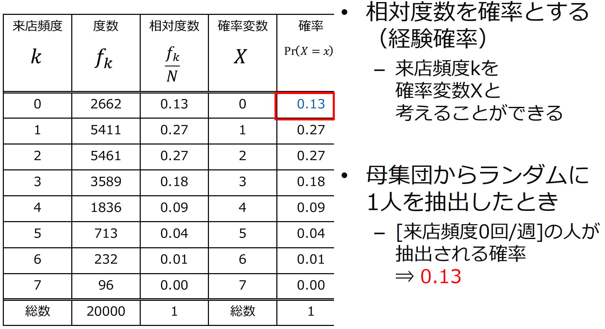

# 

<xlarge>

統計学B

</xlarge>

Week 3

#

<large>

確率と確率変数

</large>

# （１） 確率に関する諸定義

##

- 確率
  - 偶然性の確からしさを測る指標

- 事象
  - 偶然性を伴って生じる結果
    - サイコロを投げて「2」の目が出ること
    - コインを投げて表が出ること

### 例）	事象A：	コイン投げで「表」が出ること

- 余事象 complementary event
  - 事象<gray>A</gray>が起こらないこと
  - 事象<gray>A</gray>の補集合
    - コイン投げで「裏」が出る
    - <gray>$\bar{A}$</gray> ={裏}

### 例）	事象A：	コイン投げで「表」が出ること

- 全事象（標本空間）universal set
  - 起こり得る結果すべて
    - <gray>Ω={表, 裏}

- 空事象 empty set
  - 事象が何も起こらないこと
    - <gray>𝜙 （ファイ）

##

**事象A：	コイン投げで「表」が出ること**
**事象B：	コイン投げで「裏」が出ること**

- 和事象 <eng>union set</eng>
    - 事象Aまたは事象B
    - 事象Aと事象Bの少なくとも1つが起こること
      - 表か裏のどちらかが出ること
      - <gray>𝐴∪𝐵

### Union Set Example:

Let's consider two sets, A and B:

<gray>

- Set A = {1, 2, 3, 4}
- Set B = {3, 4, 5, 6}

</gray>

A∪B is the set of all elements that are in either set A or set B, or both. In this case:
<plum>A∪B={1,2,3,4,5,6}
</plum>

##

**事象A：	コイン投げで「表」が出ること**
**事象B：	コイン投げで「裏」が出ること**

- 積事象 <eng>Intersection set</eng>
  - 事象Aかつ事象B
  - 事象Aと事象Bがともに起こること
    - 表と裏の両方が出ること
    - <gray>𝐴∩𝐵

##

**事象A：	コイン投げで「表」が出ること**
**事象B：	コイン投げで「裏」が出ること**

- 排反事象 <eng>Mutually exclusive events</eng>
    - 積事象が空事象であること
      - <gray>𝐴∩𝐵=𝜙
      - 表と裏が同時に出ることはありえないため事象Aと事象Bは互いに排反である。

### Intersection Set Example:

Let's consider two sets, A and B:

<gray>

- Set A = {1, 2, 3, 4}
- Set B = {3, 4, 5, 6}

</gray>

The intersection set A∩B is the set of all elements that are common to both set A and set B. In this case:

<plum>A∩B={3,4}
</plum>

## 例題3-1　サイコロによる事象の例

- 事象A
  - 出た目が偶数
    - 2, 4, 6
- 事象B
  - 出た目が2
    - 2
- 全事象
  - サイコロの目すべて
    - 1, 2, 3, 4, 5, 6

### 例題3-1　サイコロによる事象の例

- 事象A
  - 出た目が偶数
    - 2, 4, 6
- 事象B
  - 出た目が2
    - 2
- 全事象
  - サイコロの目すべて
    - 1, 2, 3, 4, 5, 6

### 例題3-1　サイコロによる事象の例

- 事象A
  - 出た目が偶数
    - 2, 4, 6
- 事象B
  - 出た目が2
    - 2
- 全事象
  - サイコロの目すべて
    - 1, 2, 3, 4, 5, 6

### 例題3-1　サイコロによる事象の例

- 事象A
  - 出た目が偶数
    - 2, 4, 6
- 事象B
  - 出た目が2
    - 2
- 全事象
  - サイコロの目すべて
    - 1, 2, 3, 4, 5, 6

# （２） 確率の公理 
Probability Axioms

確率の公理は、確率論において確率の性質を定義し、 理論の基礎を構築するための基本的な原則です。

##

1. **非負性公理（Non-Negativity Axiom）**：
   すべての事象 $A$ に対して、その確率 $P(A)$ は非負の値を取ります。
  
   $$P(A) \geq 0$$

2. **正規化条件（Normalization Axiom）**：
   サンプル空間（全事象） $\Omega$ の確率は1です。
  
   $$P(\Omega) = 1$$

3. **加法公理（Additivity Axiom）**：
   互いに排反（相互に交わらない）な事象 $A_1, A_2, \ldots$ の列に対して、それらの和集合の確率は個別の確率の和に等しい。
    
   $$P(A_1 \cup A_2 \cup \ldots) = P(A_1) + P(A_2) + \ldots$$

## 例えば…　加法公理Additivity Axiom

- 事象Aと事象Bが排反(𝐴∩𝐵=𝜙)ならば、	
  Pr⁡(𝐴∪𝐵)=Pr⁡(𝐴)+Pr⁡(𝐵)
  - 積事象が空事象であれば、和事象の確率は和事象を構成する事象の確率の和

## 確率の公理から導かれる定理１

- ①	Pr⁡(𝜙)=0
空事象はゼロ

- ②	Pr⁡(𝐴 ̅ )=1−Pr⁡(𝐴)
（A以外の確率）＝（全体）-（Aの確率）

- ③	事象Bが事象Aに含まれるならば
Pr⁡(𝐵)≤Pr⁡(𝐴)

- ④	Pr⁡(𝐴∪𝐵)=Pr⁡(𝐴)+Pr⁡(𝐵)−Pr⁡(𝐴∩𝐵)

##

③	事象Bが事象Aに含まれるならば

Pr⁡(𝐵)≤Pr⁡(𝐴)

図で見ると一目瞭然

##

④	Pr⁡(𝐴∪𝐵)=Pr⁡(𝐴)+Pr⁡(𝐵)−Pr⁡(𝐴∩𝐵)
- 図でみるとわかりやすい
- 薄い円A（Pr⁡(𝐴)）と
薄い円B（Pr⁡(𝐵)）の合計から
重複している
濃色部分（Pr⁡(𝐴∩𝐵)）
を引く

# （３） 先験確率と経験確率
Prior Probability and Empirical Probability

##

- **先験確率** Prior Probability
  - 根元事象の可能性が同等であると考えて定義
  - 根元事象：	事象におけるひとつの要素
  - 事象に含まれる根元事象の数を計算して定義
  - 事象自体がまったくわからない場合は困難

##
- **経験確率** Empirical Probability
  - 試行の数を十分大きくしたときに
相対度数がある値に近づくならば
相対度数を確率として定義
    - 試行：	同じ条件のもとで繰り返し実験を行うこと
  - 試行できない場合や
事象がめったに起こらない場合は困難

##

- **先験確率** Prior Probability
  - 根元事象の可能性が同等であると考えて定義
  - 根元事象：	事象におけるひとつの要素
  - 事象に含まれる<red>根元事象の数</red>を計算して定義
  - 事象自体がまったくわからない場合は困難

##

- **経験確率** Empirical Probability
  - 試行の数を十分大きくしたときに
相対度数がある値に近づくならば
<red>相対度数</red>を確率として定義
    - 試行：	同じ条件のもとで繰り返し実験を行うこと
  - 試行できない場合や
事象がめったに起こらない場合は困難

##

# （４） 条件付き確率
Conditional Probability

##

条件付き確率（Conditional Probability）とは、ある事象が他の事象が起きた条件の下でどれだけ確率的に発生するかを表す概念です。
 

<medium>

$$ P(A|B) = \frac{P(A \cap B)}{P(B)} $$

</medium>

ここで、$P(A|B)$ は「事象Bが起きた条件の下で事象Aが起きる確率」を示し、$P(A \cap B)$ は事象Aと事象Bの共通部分が同時に起きる確率を示し、$P(B)$ は事象Bが起きる確率を示します。

##

## 確率の乗法定理
Multiplication Rule of Probability
複数の独立または従属する事象の同時確率を求めるための公式です。

 

<medium>

$$Pr⁡(𝐵|𝐴)  Pr⁡(𝐴)=Pr⁡(𝐴∩𝐵)$$

</medium>

条件付き確率の右辺の分母を移項

##

事象Bの確率の書き換え

<medium>

$$
Pr⁡(𝐵)=Pr⁡(𝐴∩𝐵)+Pr⁡(𝐴 ̅∩𝐵)
$$
$$
=Pr⁡(𝐵|𝐴)  Pr⁡(𝐴)+Pr⁡(𝐵|𝐴 ̅ )  Pr⁡(𝐴 ̅ )
$$

</medium>
 

# （５） 事象の独立性
Independence of events

##

- 独立
事象Bの起こる確率が事象Aの結果にまったく影響を受けない
条件付き確率でない

- 事象Aと事象Bが独立のとき同時確率は積として表現できる

## 【条件付き確率】ってどんな状況？
## 

<gray>

条件付き確率	事象Aが起こった条件下で事象Bが起こる確率
$$ Pr⁡(𝐵|𝐴)=Pr⁡(𝐴∩𝐵)/Pr⁡(𝐴) $$

</gray>
 

## 
<gray>

条件付き確率	事象Aが起こった条件下で事象Bが起こる確率
$$ Pr⁡(𝐵|𝐴)=Pr⁡(𝐴∩𝐵)/Pr⁡(𝐴) $$
</gray>
 

##
<gray>

条件付き確率	事象Aが起こった条件下で事象Bが起こる確率
$$ Pr⁡(𝐵|𝐴)=Pr⁡(𝐴∩𝐵)/Pr⁡(𝐴) $$

</gray>
 

##
<gray>

条件付き確率	事象Aが起こった条件下で事象Bが起こる確率
$$ Pr⁡(𝐵|𝐴)=Pr⁡(𝐴∩𝐵)/Pr⁡(𝐴) $$

</gray>
 

##
<gray>

条件付き確率	事象Aが起こった条件下で事象Bが起こる確率
$$ Pr⁡(𝐵|𝐴)=Pr⁡(𝐴∩𝐵)/Pr⁡(𝐴) $$

</gray>
 

##
<gray>

条件付き確率	事象Aが起こった条件下で事象Bが起こる確率
$$ Pr⁡(𝐵|𝐴)=Pr⁡(𝐴∩𝐵)/Pr⁡(𝐴) $$

</gray>
 

# 確率変数の定義

##
- 確率変数
  - 変数の概念に確率が加わったもの
    - サイコロの出た目
      - 偶然性を伴って生じる結果
  - 観測値に確率が対応している変数のこと
    - 変数
      - 観測値の集合

##

- 確率変数
𝑋=𝑋(𝜔)
  - 𝜔：事象を表す
  - 変数が離散変数のとき、確率変数は<red>離散確率変数</red>
 
- コイン投げの事例
  - 確率変数	𝑋={1, 0}

##

サイコロの出た目	⇒	確率変数
				X={1, 2, 3, 4, 5, 6}

先験確率で考えると…

##

- コイン投げの事例	⇒	確率変数
- コインを3回投げたとき表が出た回数
					X={0, 1, 2, 3}

  - コイン投げの結果は、前の回の影響を受けないので【独立】
  - 確率…3回のコイン投げの積として表現できる
    - <red>例：表が0回のとき
    - <red>(1回目裏)∗(2回目裏)∗(3回目裏)=1/2∗1/2∗1/2=1/8=0.125

##

- コイン投げの事例	⇒	確率変数
- コインを3回投げたとき表が出た回数
					X={0, 1, 2, 3}

  - 確率…3回のコイン投げの積として表現できる
    - 例：表が2回のとき
      - <red>(1回目表)∗(2回目裏)∗(3回目表)=1/2∗1/2∗1/2=1/8=0.125
      - <red>(1回目表)∗(2回目表)∗(3回目裏)=1/2∗1/2∗1/2=1/8=0.125
      - <red>(1回目裏)∗(2回目表)∗(3回目表)=1/2∗1/2∗1/2=1/8=0.125
    - <red>𝑋(2)=3∗(1/2)^3=3∗1/8=0.375

## 

<red>確率変数は、事象を介して確率を付与された変数

## （３）確率変数の例

### 母集団を無限母集団と想定すると

- 確率変数𝑿の分布（確率分布）は、母集団の分布を表している
  - 実際には確率分布はわからないことが一般的なので
  実験や調査が必要になる

##

- コイン投げで表がでる比率を考えると
  - コイン投げ（試行）が無限に実行できる
  ⇒無限母集団から標本を抽出していることと同じ

- 観測値𝑥	
  - 実際にコイン投げをしたときに表の出た回数
  - 標本における統計値（データ）
- 確率Pr⁡(𝑋=𝑥)
  - 確率変数𝑋が観測値𝑥をとる確率

### 母集団を有限母集団と想定すると
母集団を有限母集団と想定すると

# 第3章のまとめ
<small>

- 確率の公理
  - 【確率の公理】を満たさないものは確率ではない
    - 0から1の間
    - 全部足したら1
    - AとBが排反ならばPr⁡(𝐴∪𝐵)=Pr⁡(𝐴)+Pr⁡(𝐵)
- 先験確率と経験確率
  - 先験確率
    - 根元事象の確率が同等であると定義
    - 事象自体が不明な場合は困難
  - 経験確率
    - 相対度数を確率として定義
    - 試行できない場合やめったに起こらない場合は困難
- 確率変数
  - 確率が付与された変数