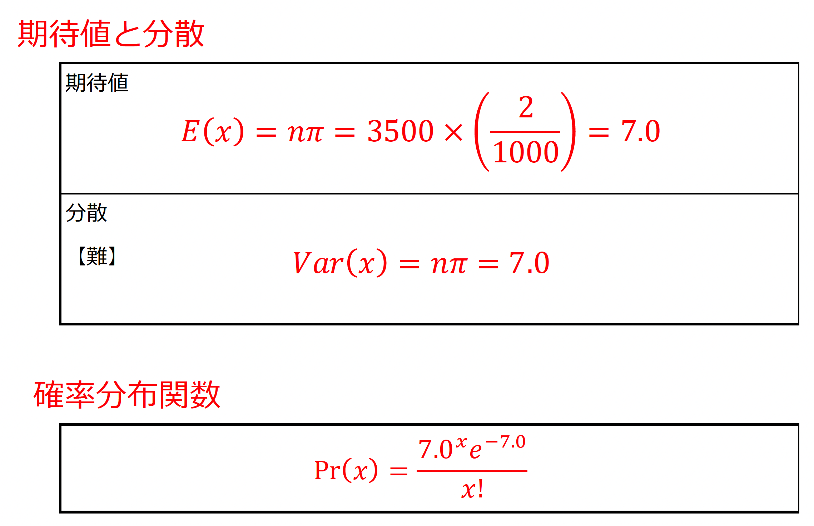

# 

<xlarge>

統計学B

</xlarge>

Week 5

#

<large>

大数の法則

</large>

The law of large numbers

#

- The Law of Large Numbers is a fundamental concept in probability theory and statistics. It states that as the sample size increases, the sample mean approaches the true population mean. In other words, as you collect more and more data points, the average of those data points will become closer to the expected value of the entire population.

## 確率変数の期待値
The expected value of a random variable

##

- The expected value of a random variable is a fundamental concept in probability theory and statistics. It represents the long-term average or "expected" outcome of the variable when it is repeated over a large number of trials. 

## （１）確率変数の関数

## 確率変数の期待値

- 確率変数𝑋の観測値𝑥に 確率Pr⁡(𝑋=𝑥)または確率密度関数𝑓(𝑥)を 乗じたものの総和
- <red>確率変数と確率の積和</red>（確率分布の平均値と同じ）

## 確率変数の分散

- 確率変数の関数として$𝑔(𝑋)=(𝑋−𝜇_𝑥 )^2$とすると

- 確率分布の分散と同じ
- 確率分布の平均値と分散は
<red>期待値の特別な形式

## （３） 期待値の基本的な性質

## 期待値の基本的な性質①

- 𝑋と𝑌	：確率変数
𝑎と𝑏		：定数

<medium>

$𝐸(𝑎𝑋+𝑏)=𝑎𝐸(𝑋)+𝑏$

</medium>

- 定数（𝑎と𝑏）は確率変数ではないので
対応する確率は存在しない

## 期待値の基本的な性質②

- 𝑋と𝑌	：確率変数
𝑎と𝑏		：定数

<medium>

$𝐸(𝑋+𝑌)=𝐸(𝑋)+𝐸(𝑌)
$

</medium>

- 確率変数の和の期待値は
期待値の和と同じ
- 𝑋と𝑌が独立でなくても成り立つ

## Example $E(X+Y)$

**例: 公平なコインを2回投げる**

- 2つの公平なコインを持っており、$X$ と $Y$ という2つの確率変数に興味があります。ここで：
  - $X$ は、最初のコインを投げたときに得られる表の数を表します。
  - $Y$ は、2番目のコインを投げたときに得られる表の数を表します。
 
- $X$ と $Y$ はともに0（表が出ない）から1（表が1回出る）までの値を取り、各結果は等しい確率で発生します。

##

**期待値の線形性を利用:**

<gray>$E(X + Y) = E(X) + E(Y)$</gray>

- まず、$X$ の期待値 $E(X)$ を計算します。$X$ は、最初のコインを投げたときに表が出る回数を表し、各コイン投げにおいて表が出る確率（成功確率 $p$）は0.5（各コインが表または裏のどちらかが出る確率が同じ）です：

<gray>$E(X) = p = 0.5$</gray>

- 同様に、$E(Y)$ も0.5です。これは、$Y$ が2番目のコインを投げたときに表が出る回数を表し、同じ確率分布に従うためです。
##
- そして、線形性の性質を用いて $E(X + Y)$ を計算します：

  - <gray>$E(X + Y) = E(X) + E(Y) = 0.5 + 0.5 = 1$</gray>
 
- したがって、この例における $E(X + Y)$ は1です。これは、2つの公平なコインを投げて表の合計回数を数えると、平均して1回表が出ることを意味します。

## 期待値の基本的な性質③

- 𝑋と𝑌	：確率変数
𝑎と𝑏		：定数

<medium>

$𝑉𝑎𝑟(𝑎𝑋+𝑏)=𝑎^2 𝑉𝑎𝑟(𝑋)$

</medium>

- 分散は散らばりを表すため
定数𝑏が加えられても分散は変わらない

## 期待値の基本的な性質④

- 𝑋と𝑌	：確率変数
𝑎と𝑏		：定数

$𝑉𝑎𝑟(𝑋)=𝐸[(𝑋−𝐸(𝑋))^2 ]=𝐸(𝑋^2 )−[𝐸(𝑋)]^2$

- 分散は期待値の特別な形式
期待値を用いて書き直すことができる

## 期待値の基本的な性質⑤

- 𝑋と𝑌	：確率変数
𝑎と𝑏		：定数

<medium>

$𝐸(𝑋𝑌)=𝐸(𝑋)𝐸(𝑌)
$

</medium>

- 𝑋と𝑌が<red>独立</red>である場合のみ成り立つ

## 期待値の基本的な性質⑥

- 𝑋と𝑌	：確率変数
𝑎と𝑏		：定数

<medium>

$𝑉𝑎𝑟(𝑋+𝑌)=𝑉𝑎𝑟(𝑋)+𝑉𝑎𝑟(𝑌)$

</medium>

- 𝑋と𝑌が<red>独立</red>である場合のみ成り立つ

## （４）二項分布にしたがう確率変数の期待値

##
- 確率変数𝑋が二項分布にしたがう	：𝑋~𝐵(𝑛, 𝜋)
  - 期待値
  <gray>$E(X) = n𝜋$</gray>
  - 分散
  <gray>$Var(X) = n𝜋(1-𝜋)$</gray>

  <plum>超重要！</plum>

## 練習問題

- 打率3割2分8厘（0.328）の野球選手が、今日の試合で5回打席に立つときのヒットの本数𝑥の確率を考える。ヒットの本数の期待値と分散を求めなさい。

  - 公式を用いて解くと簡単！
    - 期待値	𝐸(𝑋)=𝑛𝜋
    - 分散		𝑉𝑎𝑟(𝑋)=𝑛𝜋(1−𝜋)

## p. 64 問題5-1

- 確率変数𝑋が二項分布にしたがうとき確率変数𝑋の関数$𝑔(𝑋)=\frac{𝑋}{𝑛}$を確率変数𝑌とする
- 確率変数𝑌の期待値𝐸(𝑌)と分散𝑉𝑎𝑟(𝑌)を求めよ
  - 期待値の基本的性質aとcを使って解きます

- 基本的性質<plum>a</plum>より
<red>$𝐸(𝑌)=𝐸(\frac{𝑋}𝑛)=\frac{1}𝑛 𝐸(𝑋)=\frac{1}𝑛 𝑛𝜋=𝜋$
- 基本的性質<plum>c</plum>より
<red>$𝑉𝑎𝑟(𝑌)=𝑉𝑎𝑟(\frac{𝑋}𝑛)=\frac{1}{𝑛^2}  𝑉𝑎𝑟(𝑋)=\frac{1}{𝑛^2}  𝑛𝜋(1−𝜋)=\frac{1}𝑛 𝜋(1−𝜋)$

## 応用問題
<medium>

> 大数の法則→標本の大きさ𝑛を大きくすればするほど標本の状況は母集団の状況に近づく

</medium>
 

- ある工場で不良品の製品は1,000個中2個あることがわかっている。
- これから出荷する製品3,500個のうち、不良品の数を𝑥とするとその確率分布は<red>ポアソン分布</red>で近似できるものとする。
- ただし、ポアソン分布関数は
$Pr⁡(𝑥)=\frac{(𝜇^𝑥 𝑒^{-𝜇})}{𝑥!}$とする

## ポアソン分布の期待値と分散

- ポアソン分布
  - 二項分布のひとつ
  - 𝜋（起こる確率）が極端に小さい場合
  すなわち<red>𝒏𝝅が一定とみなせる</red>場合（pp. 50）

  - <red>ポアソン分布では期待値と分散は同じ式で表せる</red>
    - 𝜋が極端に小さいので，(1−𝜋)≒1と考える．

期待値 𝐸(𝑥)=𝑛𝜋
分散 𝑉𝑎𝑟(𝑥)=𝑛𝜋

##

## p65 問題5-2

- あるテレビ番組の視聴を事象とすると
事象は2つ（視た・視なかった）なので
視聴した世帯数は二項分布にしたがう
- 視聴した世帯数を𝑥とおくと
問題5-1で定義した確率変数𝑌は
視聴率を表す
- 𝑛=200, 𝜋=0.10のときの
視聴率の期待値と標準偏差を求めよ

##
- 問題5-1より
  - 期待値
<gray>$𝐸(𝑌)=𝜋=0.10$

  - 分散
<gray>$𝑉𝑎𝑟(𝑌)=\frac{1}{𝑛} 𝜋(1−𝜋)=\frac{1}{200}×0.10×0.90=0.00045$

  - 標準偏差
<gray>$\sqrt{𝑉𝑎𝑟(𝑌)} =\sqrt{0.00045}=0.0212$

# 大数の法則
Law of large numbers

<medium>

> 試行数あるいは標本数（𝑛）の大きさを大きくすると標本の状況は母集団の状況に近づく

</medium>

- 経験確率	
  - 試行回数𝑛を大きくしたときに
  - 相対度数がある値に近づくならば
  - 相対度数＝確率　とする

<plum>超重要！</plum>

## 大数の法則の事例

- 教科書 pp. 48 例題4-1	標本数𝑛=10
- 教科書 pp. 49 問題4-1	標本数𝑛=20

- 母集団での比率	𝜋=0.6
- 標本比率		$\frac{𝑥}𝑛$

- 標本比率が母集団の比率の±0.1の範囲
$0.5<\frac{𝑥}𝑛<0.7$に入る確率を計算

例題4-1	⇒	0.67
問題4-1	⇒	0.75

<red>標本比率が母集団の比率に近づく可能性

## 第5章のまとめ

- 確率変数の期待値
  - 確率変数と確率の積和
  - 確率分布の平均値と分散は期待値の特別な形式
    - 確率分布を特定できれば期待値を求めることができる
- <red>確率変数が二項分布にしたがうとき
  - 期待値		𝐸(𝑋)=𝑛𝜋
  - 分散		𝑉𝑎𝑟(𝑋)=𝑛𝜋(1−𝜋)
- 大数の法則
  - 標本の大きさnを大きくしたときに
  標本の状況が母集団の状況に近づくこと
