

# 

<xlarge>

統計学B

</xlarge>

Week 6

# 先週の続き: <red>連続</red>確率分布
continuous probability distribution

##

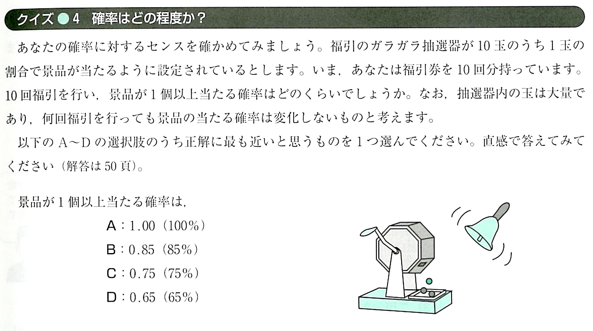

## （１） 連続確率分布の性質

### 連続確率変数に対応する確率$Pr⁡(𝑋=𝑥)$は<red>ゼロ</red>になる
$Pr⁡(𝑋=𝑥)=0$

- 😟え？なんで？
  - X が取り得る値は<red>無限</red>に存在するため、X が特定の値を取る確率は<red>ゼロ</red>

##

- There are no "exact" values
  - $Pr⁡(𝑋=𝑥)=0$
- 連続変数では<red>相対度数は表現できない</red>が、
- 連続変数では<red>累積度数は表現できる</red>
  - 駅からの距離<red>480m0cm0mm</red>ちょうどの物件はほぼないが、
  - 駅からの距離<red>480m以下</red>の物件数は計算できる

## 分布関数 p51
<medium>
累計度数

Cumulative Distribution Function (CDF)
</medium>

##

- 分布関数
𝐹(𝑥)=Pr⁡(𝑋<𝑥)=Pr⁡(𝜔:𝑋(𝜔)<𝑥)
  - すべての根元事象の集合：	
  {𝜔:𝑋(𝜔)<𝑥}
  - 連続確率変数𝑋が𝑥以下である確率

  - 確率には相対度数が対応
  - 分布関数には累積度数が対応
- 単調に増加する関数
  - 減少することがない
- 𝑥の取り得る値は-∞から∞の間
  - 𝐹(−∞)=0
  - 𝐹(+∞)=1
<!-- 
##

- 駅から離れれば離れるほど物件が見つかる確率🏠🏠
- 歩けば、歩くほどポケモンが捕まる確率👾🧌👹

など… -->

## 確率密度関数  

  The probability density function (PDF) 
$$
F(y) = \int_{−∞}^{y} f(x) \, dx 
$$

##
<xl>

$\int_{-∞}^{∞}f(x) \, dx$

</lx>

##
<xl>

$\int_{-∞}^{y}f(x) \, dx$

</lx>

##
<xl>

$\int_{\alpha}^{\beta}f(x) \, dx$

</lx>

## 確率密度分布 𝑓(𝑥)

## 確率密度分布𝑓(𝑥)と𝑥軸の間の面積は1

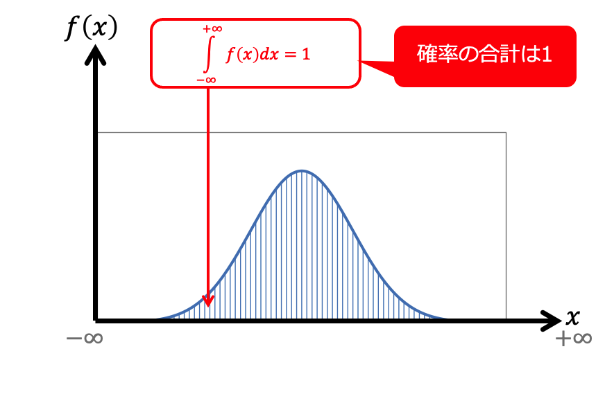

## 𝑥が𝑦のときの𝑓(𝑥)と𝑥軸で囲まれた部分の面積

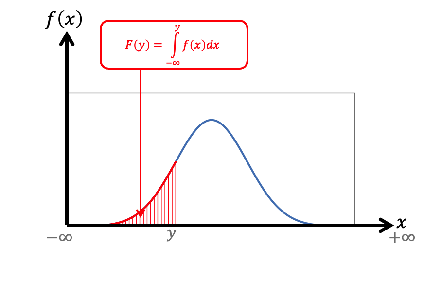

## 分布関数 𝐹(𝑥)

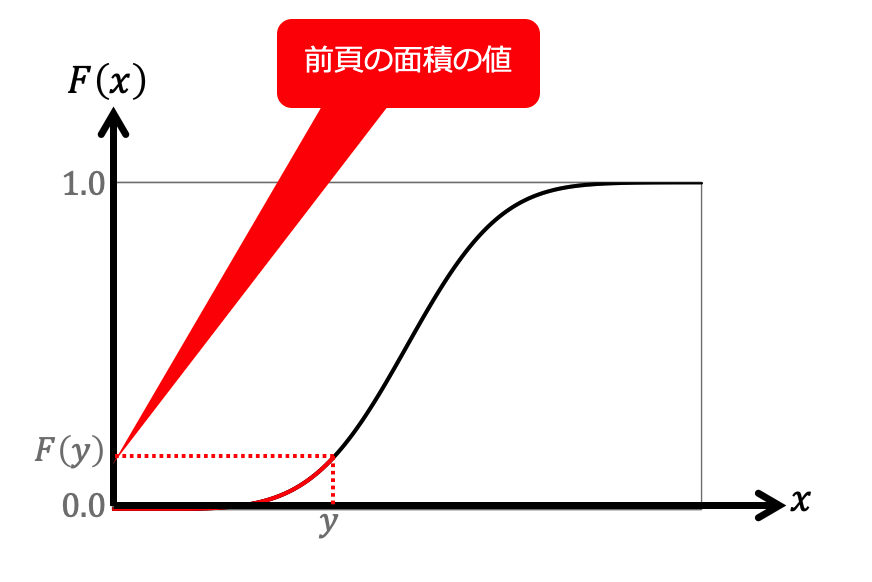

## 色部分の面積　Pr⁡(𝛼<𝑋<𝛽)　の求め方

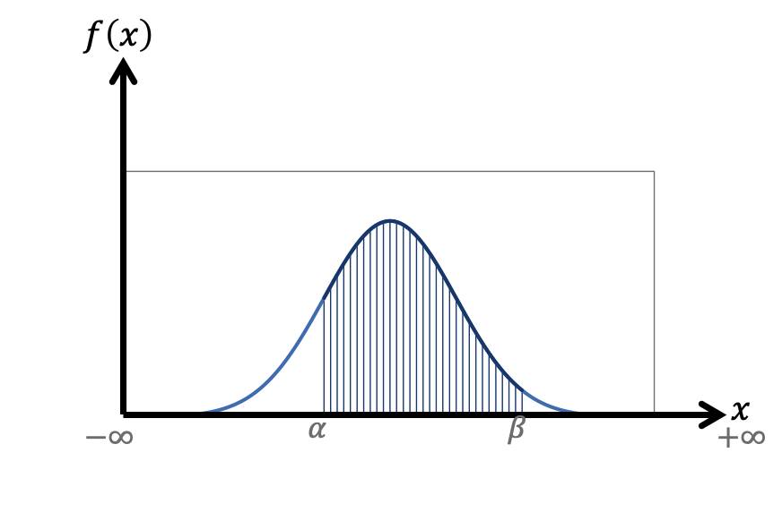

## 緑の面積から赤の面積を引く

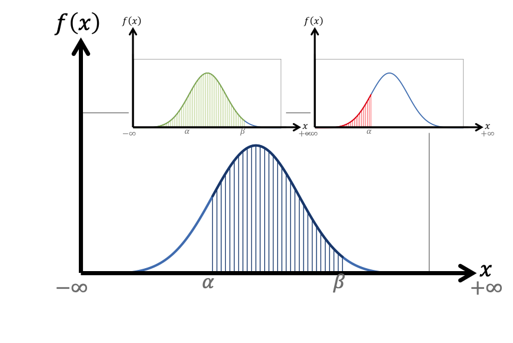

## 緑の面積から赤の面積を引く

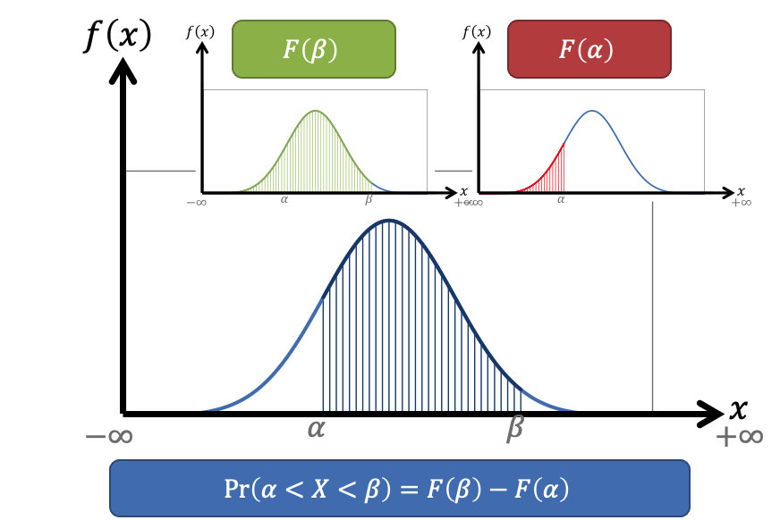

##

## p52
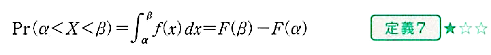

## （３）その他の連続確率分布

- 一様分布 uniform distribution
  - 前述
- 指数分布 exponential distribution
  - 事象が起こる時間間隔を表現する連続確率分布  

- <red>第6章以降に登場</red>
  - 正規分布 normal distribution
  - カイ二乗分布 Chi-Square Distribution
  - t分布 Student's t-Distribution
  - F分布 F-Distribution

## （１）確率分布の平均値と分散の定義 p54
The mean and variance of the probability distribution

##

- 確率分布は母集団の分布
⇒<red>母平均𝜇と母分散$𝜎^2$は確率分布の平均値と分散

- 母平均
  - 離散確率変数の場合　$𝜇_𝑥=∑_𝑥 𝑥 Pr⁡(𝑋=𝑥)$
  - 連続確率変数の場合　$𝜇_𝑥=∫_{−∞}^{+∞}𝑥 𝑓(𝑥)𝑑𝑥$
- 母分散
  - 離散確率変数の場合　$𝜎_𝑥^2=∑_𝑥(𝑥−𝜇_𝑥 )^2  Pr⁡(𝑋=𝑥)$
  - 連続確率変数の場合　$𝜎_𝑥^2=∫_{−∞}^{+∞}(𝑥−𝜇_𝑥 )^2  𝑓(𝑥)𝑑𝑥$

##

- 確率分布は母集団の分布
⇒<red>母平均𝜇と母分散$𝜎^2$は確率分布の平均値と分散

- 母平均
  - 離散確率変数の場合　$𝜇_𝑥=∑_𝑥 \textcolor{red}{𝑥} Pr⁡(𝑋=𝑥)$
  - 連続確率変数の場合　$𝜇_𝑥=∫_{−∞}^{+∞}\textcolor{red}𝑥 𝑓(𝑥)𝑑𝑥$
- 母分散
  - 離散確率変数の場合　$𝜎_𝑥^2=∑_𝑥\textcolor{blue}{(𝑥−𝜇_𝑥 )^2}  Pr⁡(𝑋=𝑥)$
  - 連続確率変数の場合　$𝜎_𝑥^2=∫_{−∞}^{+∞}\textcolor{blue}{(𝑥−𝜇_𝑥 )^2}  𝑓(𝑥)𝑑𝑥$

## 🏋🏻‍♀️🏋🏻‍♀️🏋🏻‍♀️🏋🏻‍♂️🏋🏻‍♂️
例: $X$ = １週間でジムに行く回数とその確率

$X$ | $P(X)$
--|--
0|0.10
1|0.15
2|0.40
3|0.25
4|0.10

では、<red>平均</red>で週に何回ジムに行くでしょうか？

##

<!-- 
## 🏋🏻‍♀️🏋🏻‍♀️🏋🏻‍♀️🏋🏻‍♂️🏋🏻‍♂️

$𝜇_𝑥=∑_𝑥 𝑥 Pr⁡(𝑋=𝑥)$

$$
\begin{align*}
  𝜇_𝑥 &= 0*0.1+1*0.15+2*0.4+3*0.25+4*0.1 \\ 
  &=2.1
\end{align*}
$$

The expected value (average) of workout days is 2.1
 -->

## （２）確率分布の平均値と分散の考え方

##

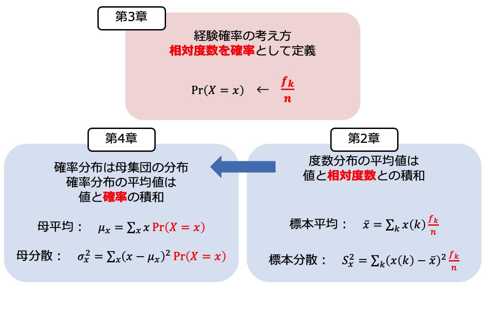

##

## 例題4-2 p55

## 例題4-2

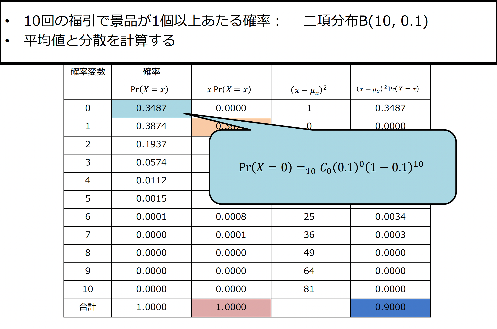

## 例題4-2

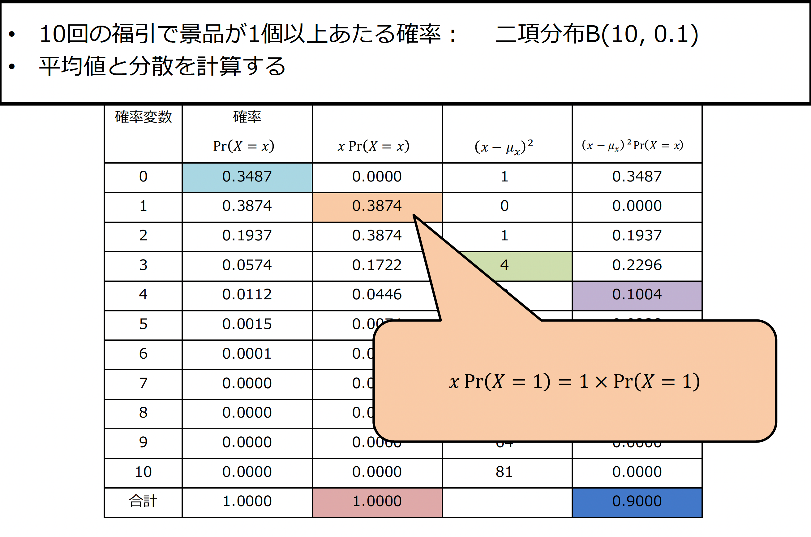

## 例題4-2

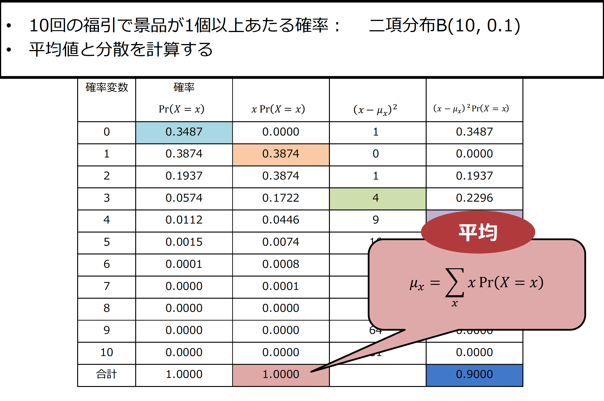

## 例題4-2

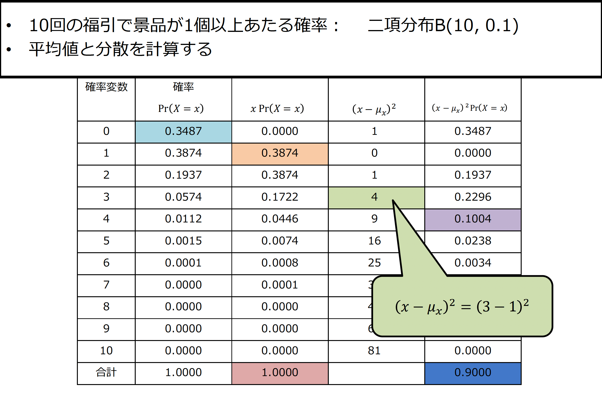

## 例題4-2

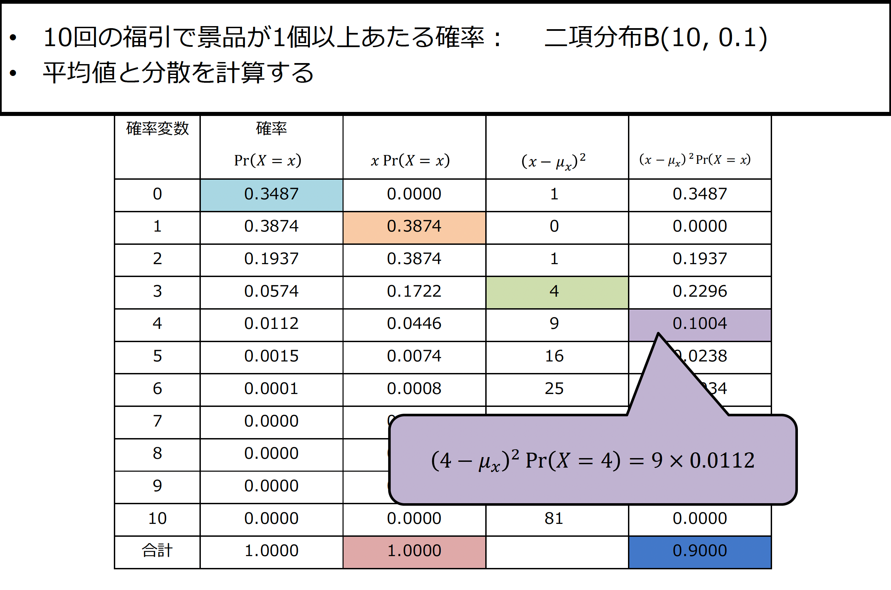

## 例題4-2

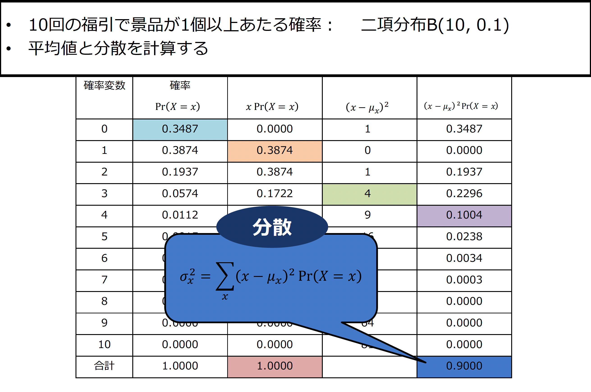

## 例題4-2

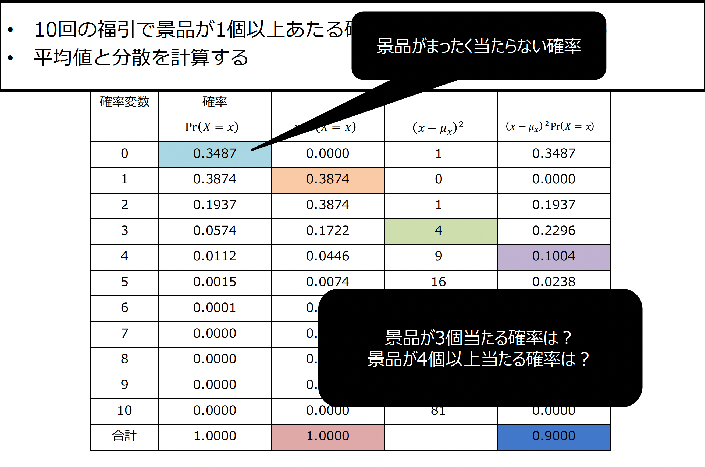

## 例題4-2

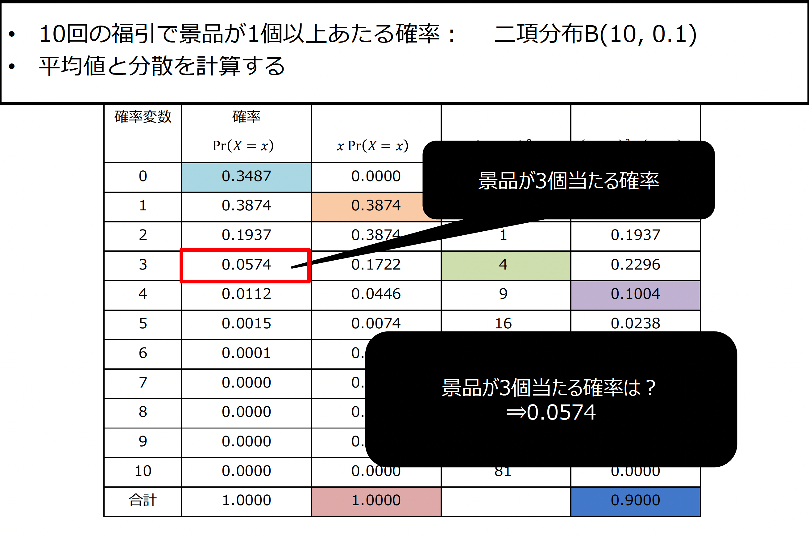

## 例題4-2

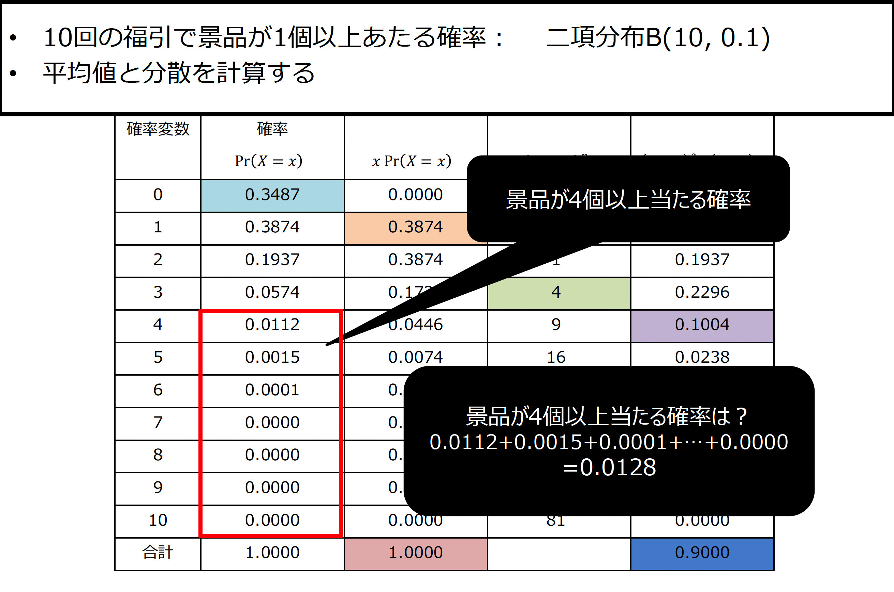

## 問題

ガリガリくんのあたり棒が出る確率を1/4(0.25)とする

## 問題

ガリガリくんを毎週5個ずつ買ったら、
<red>平均</red>で何個当たる？

##
    
ガリガリくんを毎週5個ずつ買ったら、
<red>平均</red>で何個当たる？
<medium>$X$</medium> <small>当たり棒の数</small> | <medium>$Pr(X=x)$</medium> <small>確率</small> | <medium>$xPr(X=x)$</medium> <small>-</small>
--|--|--
0| |
1| |
2| 0.2637|0.5273
3| |
4| |
5| |
合計| |

##
    

Hint:

- 確率の計算は

<medium>

$$ 
P(X = x) =  _nC_x \cdot \pi^x \cdot (1 - \pi)^{n - x}

$$

</medium>

$n = 5$
$\pi = 0.25$
$x$は各行の値

## 第4章（後半）のまとめ 
<small>

- 連続確率分布
  - 分布関数と確率密度で表現する
  - 一様分布
    - 値のとり得る範囲のみの情報がある確率分布
  - その他の連続確率分布
    - 指数分布
      - 事象が起こる時間間隔を表現する分布
    - 正規分布
    - カイ二乗分布
    - t分布
    - F分布

- 確率分布の平均と分散
  - 母集団の平均値と分散
  - 経験確率の考え方を利用
    - 標本の平均値	値と相対度数の積和
    - 母集団の平均値	値と確率の積和
