

# 

<xlarge>

統計学B

</xlarge>

Week 7

# 正規分布とカイ二乗分布

Normal Distribution and Chi-Square Distribution

# 正規分布

[YouTube: Standard Normal Distribution](https://youtu.be/coA8gz9Uacg?si=xJy00rB2ixyryccr)

## 　（１）正規分布の確率計算

- 正規分布　（復習）
  - 平均を中心とした左右対称の連続確率分布
- 中心極限定理　（復習）
  - 標本平均は正規分布にしたがう
  - 母集団がどのような分布であっても
標本平均に関しては確率による評価ができる
    - 確率計算は簡単ではない…

$$
Pr⁡(𝛼<𝑋<𝛽)=∫_𝛼^𝛽𝑓(𝑥)𝑑𝑥=∫_𝛼^𝛽\frac{1}{\sqrt2𝜋𝜎_𝑋^2} exp⁡\{−\frac{(𝑥−𝜇_𝑋)^2}{2𝜎_𝑋^2}\}𝑑𝑥
$$

## （２）標準正規分布
standard normal distribution

### 標準正規分布

- 標準化　（復習）
  - 平均値と標準偏差を統一する方法
    - 平均＝０
    - 標準偏差＝１

- 標準化が適用できない場合
  - データに外れ値が含まれる場合
  - 度数分布が左右対称の単峰の分布でない場合
    - 正規分布は<red>左右対称</red>の確率分布で
    <red>外れ値が生じない</red>形状なので
    標準化を適用できる！

### 標準正規分布

- 正規分布の標準化
  - 標本平均𝑋 ̅を標準化する
  - $𝑍：\bar{𝑋}$を標準化した確率変数

$$𝑍=\frac{𝑋 ̅−𝐸(\bar{𝑋 ̅})}{\sqrt{𝑉𝑎𝑟(\bar{𝑋})}}=\frac{\bar{𝑋}−𝜇_𝑋}{\sqrt\frac{𝜎_𝑋^2}{𝑛}}=\frac{標本平均−母平均}{\sqrt{\frac{母分散}{標本数}}}$$

### 標準正規分布

- 標準正規分布
𝑍~𝑁(0,1)
  - 確率変数𝑍（標本平均 $\bar{𝑋}$ を標準化したもの）
  - 平均＝０
  - 標準偏差＝１（分散＝１）
    - 確率密度関数
    - $𝑓(𝑧)=\frac{1}{\sqrt{2𝜋}}exp\{-\frac{𝑧^2}2\}$ 
    
## （３）標準正規分布表の見方 （４）標準正規分布表に基づく確率計算

### 標準正規分布表の見方
<plum>超重要！</plum>
<small>
- 標準正規分布表
  - 標準正規分布にしたがう確率変数に関する
確率を計算して一覧表にしたもの
  - 教科書pp.162（付録2）

  - 𝑍の値𝑧に対応した標準正規分布𝑁(0,1)の
上側確率Pr⁡(𝑍>𝑧)が計算されている
</small>

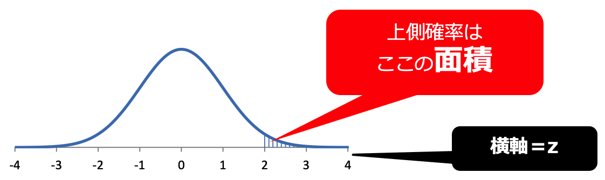

### 標準正規分布表の見方

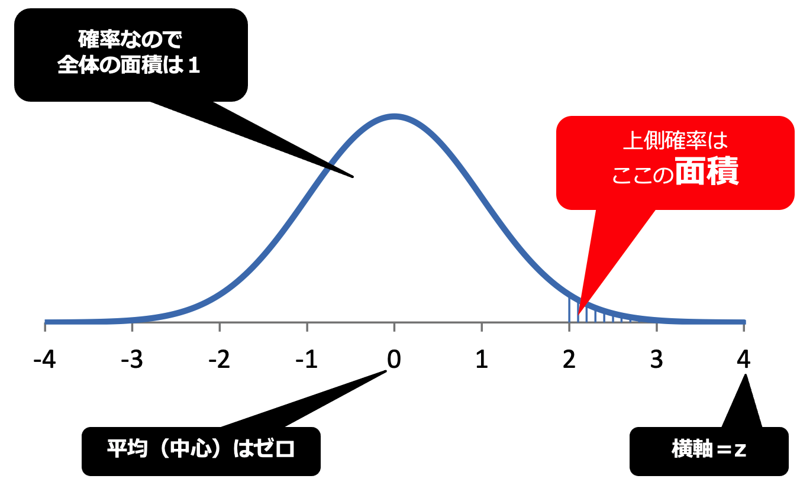

### 例）z=2.00のとき

### 例）z=2.00のとき

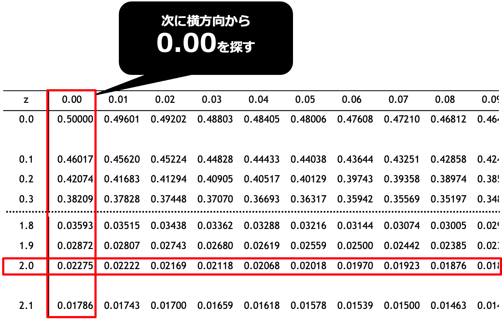

### 例）z=2.00のとき

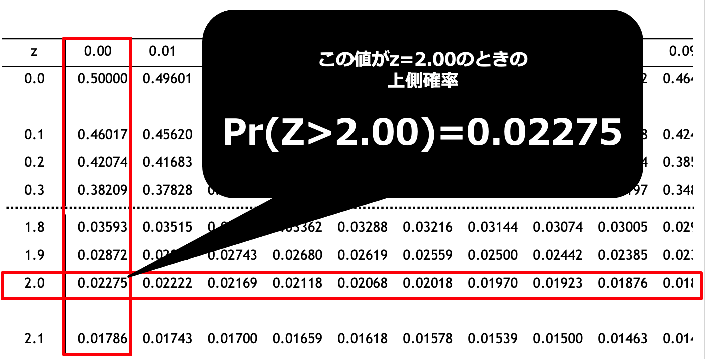

### 例）z=5.00のとき

<small>

- 標準正規分布表にはz=3.09までしかない…
  - もっとも近い値で計算する
  - z=3.09の確率をみると
    0.00100とものすごく小さい値
  - z>3.09のときはどんどん0に近似するので
    ほぼ0とみなすことが多い
    教科書によってはさらに細かい表まであることもある
</small>

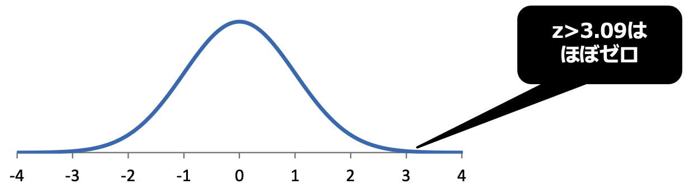

### 例）z=-2.00のとき

- もしzがマイナスの値だったら…？
  - 左右対称
  - 面積全体は1
  (確率の合計は1)
    - つまり、絶対値の上側確率を計算して1から引けば求めることができる

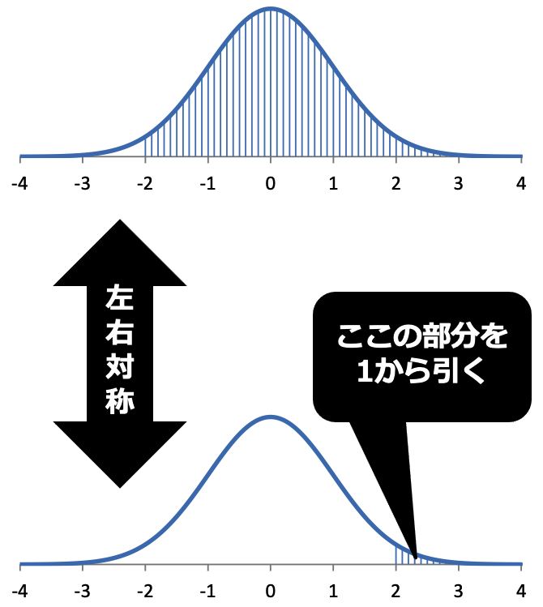

### 例）-1.00<z<1.00のとき

- Pr⁡(−1.00<𝑍<1.00)
正規分布は左右対称
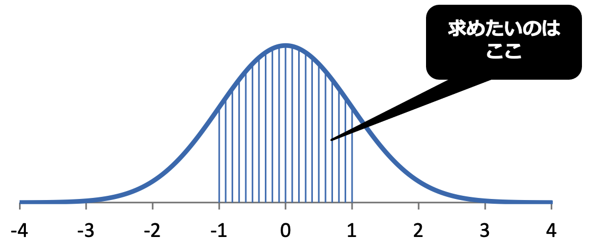

### 例）-1.00<z<1.00のとき

- Pr⁡(−1.00<𝑍<1.00)
正規分布は左右対称
<red>両端の白い部分の面積は同じ</red>

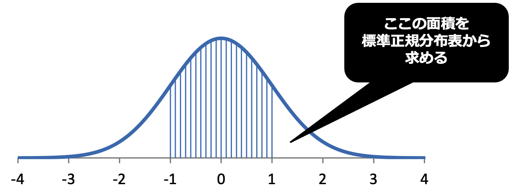

### 例）-1.00<z<1.00のとき

- Pr⁡(−1.00<𝑍<1.00)
正規分布は左右対称
両端の白い部分の面積は同じ
<red>確率の合計は1</red>

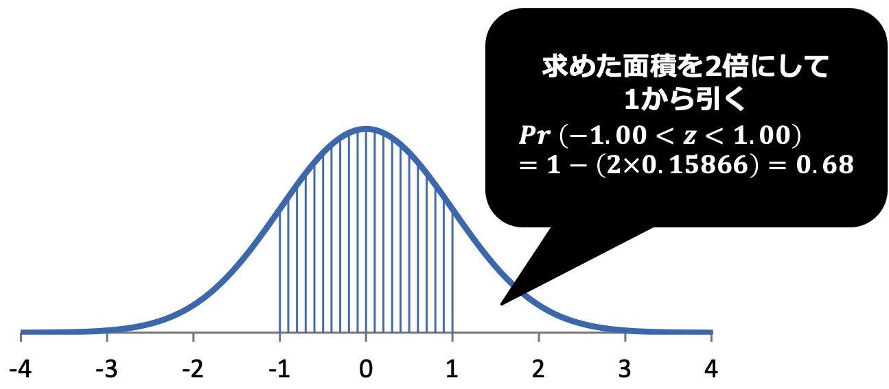

### p86 例題7-1

- 母集団2万人の来店頻度
  - 平均		$2.00$
  - 標準偏差	$1.41$
  - 分散		$1.41^2=1.976$
- 標本平均𝑋 ̅の分布⇒正規分布
  - 平均		$2.00$
  - 分散		$\frac{1.976}𝑛$
- 標本の大きさが200のときに
母平均±0.1の範囲内に
標本平均が含まれる確率を求める

### p86 例題7-1

- 母平均	2.00
- 母分散	1.976
- 標本数	200

- 標本平均が母平均より0.1大きい場合のZ

$$
𝑍=\frac{\bar{𝑋} −𝐸(\bar{𝑋}  )}{\sqrt{𝑉𝑎𝑟(\bar{𝑋}  )}} )=\frac{\bar{𝑋} −𝜇_𝑋}{\sqrt{\frac{𝜎_𝑋^2}{𝑛}}}=\frac{標本平均−母平均}{\sqrt{\frac{母分散}{標本数}}}
$$

### p86 例題7-1

- 母平均	2.00
- 母分散	1.976
- 標本数	200

- 標本平均が母平均より0.1大きい場合のZ

$$
𝑍=\frac{\bar{𝑋} −𝐸(\bar{𝑋}  )}{\sqrt{𝑉𝑎𝑟(\bar{𝑋}  )}} )=\frac{\bar{𝑋} −𝜇_𝑋}{\sqrt{\frac{𝜎_𝑋^2}{𝑛}}}=\frac{2.10-2.00}{\sqrt{\frac{1.976}{200}}}=1.01
$$

### p86 例題7-1

- 母平均	2.00
- 母分散	1.976
- 標本数	200

- $Z=1.01$のときの上側確率を
標準正規分布表から求める
- $Pr⁡(−1.01<𝑍<1.01)$を求める

### p87 例題7-1

- 標本数がn=1000のとき
母平均±0.1の範囲内に
標本平均が含まれる確率を求めよ

### p87 例題7-1

- 標本数がn=1000のとき
母平均±0.1の範囲内に
標本平均が含まれる確率を求めよ

$$
𝑍=\frac{\bar{𝑋} −𝐸(\bar{𝑋}  )}{\sqrt{𝑉𝑎𝑟(\bar{𝑋}  )}} )=\frac{\bar{𝑋} −𝜇_𝑋}{\sqrt{\frac{𝜎_𝑋^2}{𝑛}}}=\frac{2.10-2.00}{\sqrt{\frac{1.976}{1000}}}≈2.25
$$

## （６）確率分布の再生性

### 確率分布の再生性

- 同じ確率分布にしたがう２つの独立な確率変数
  - $𝑋_1$ と $𝑋_2$
２つの確率変数の和 $𝑋_1+𝑋_2$
- 同じ確率分布にしたがうならば
その確率分布は<red>再生性</red>をもつ
  - 再生性をもつ確率分布
    - 二項分布
    - ポアソン分布
    - 正規分布
    - カイ二乗分布
  - 中心極限定理が適用される
    - 標本の大きさを大きくしたとき標準正規分布に近似

# カイ二乗分布

## （１）カイ二乗分布の定義

### カイ二乗分布の定義

- $𝜒^2$ 分布　（chi-squared distribution）
  - 自由度𝜈のカイ二乗分布
  - 標準正規分布𝑁(0,1)にしたがう
    独立な𝜈個の確率変数𝑋_𝑖の
    平方和に関する確率分布
    - $𝜒^2 (𝜈)~𝑋_1^2+𝑋_2^2+𝑋_3^2+…+𝑋_𝜈^2$
  - <red>平均値		𝜈	自由度と等しい
  - <red>分散		2𝜈	自由度の2倍
  - 自由度が小さいとき左右非対称
    - 自由度が大きくなるにつれて左右対称に変化
  - 自由度の値が大きいときに<red>正規分布に近似

### 自由度 degree of freedom

- 自由に動くことのできる変数の数
- 与えられた等式（条件）の分だけ減る

  - 例	データ（4, x, 1, 1）	xは未知
    条件	平均値は2
    ⇒　4+𝑥+1+1=2×4
  - データの個数n個に
平均値を与える（条件1つ）と
データ<red>n-1</red>個がわかれば、すべてのデータがわかる
（残りの1つは必然的に決まる）

### 自由度10のカイ二乗分布

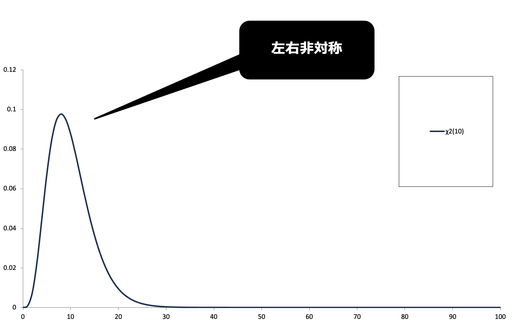

### 自由度10～50のカイ二乗分布

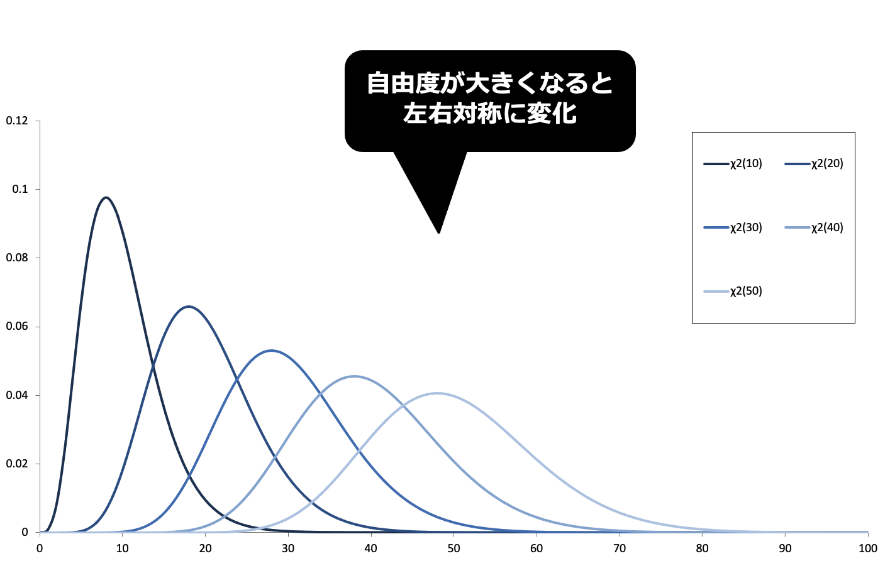

### 平方和の分解

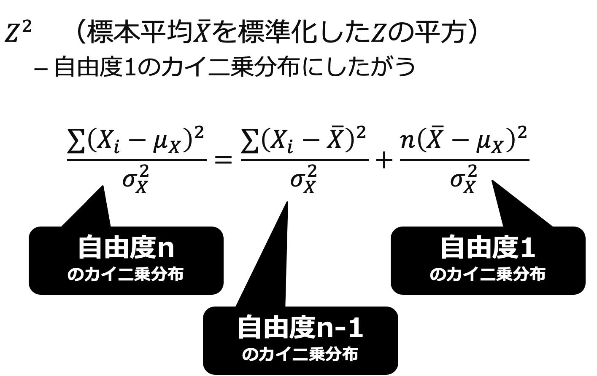

## 第7章のまとめ

<small>

- 標準正規分布
  - 平均 0
  - 分散 1
- 標準正規分布表
  - 上側確率Pr⁡(𝑍>𝑧)を求めることができる
  - ある区間内に含まれる確率は標準化により求める
- 再生性
  - 二項分布・ポアソン分布
  - 正規分布
  - カイ二乗分布
- カイ二乗分布
  - 標準正規分布の二乗和に関する確率分布
  - 自由度が大きくなると正規分布に近似
- 自由度
  - 自由に動くことのできる変数の数
  - 与えられた等式（条件）の分だけ減る

</small>