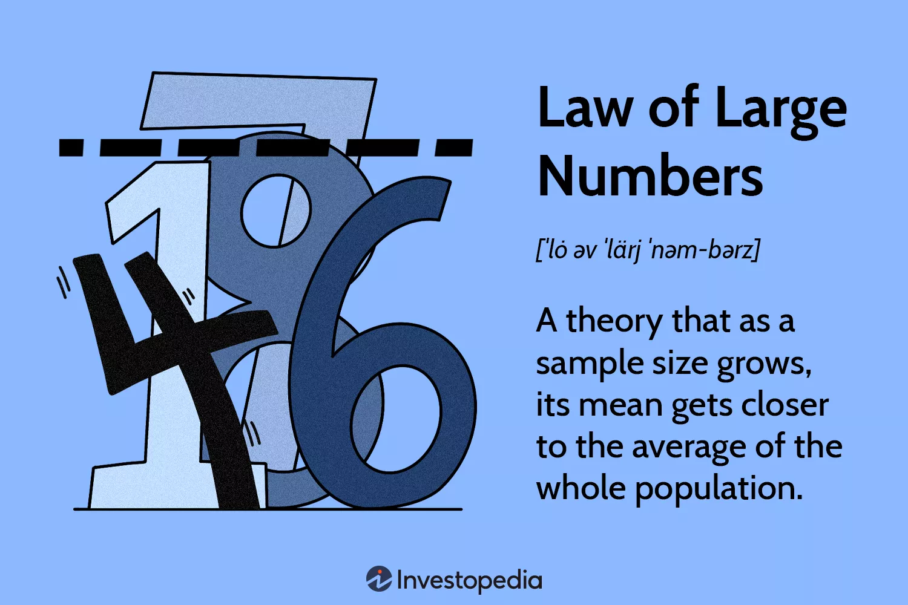
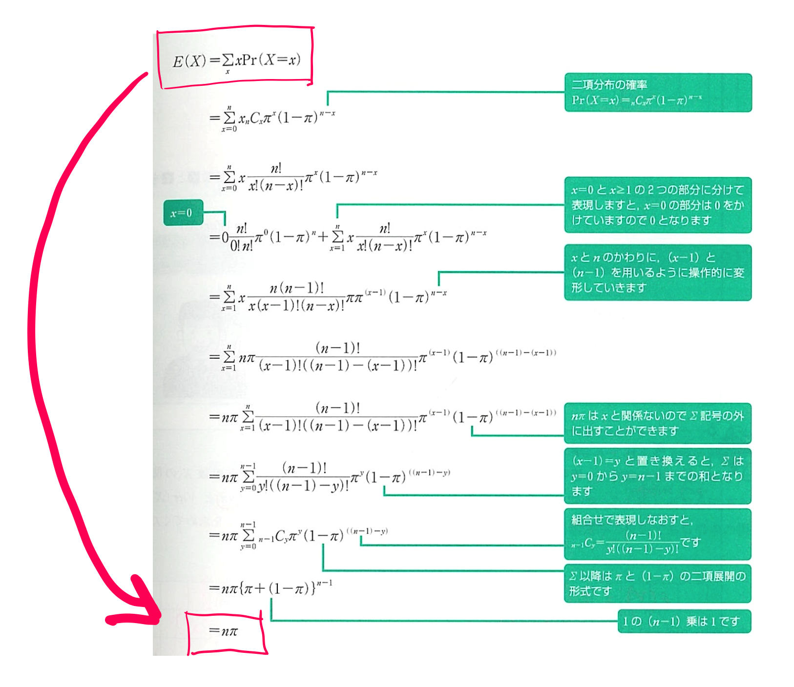
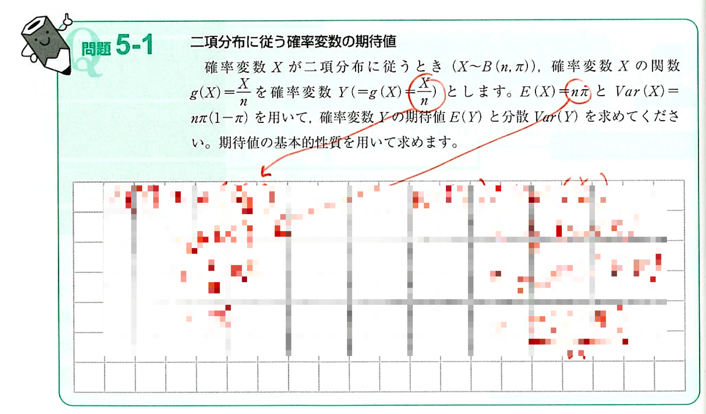
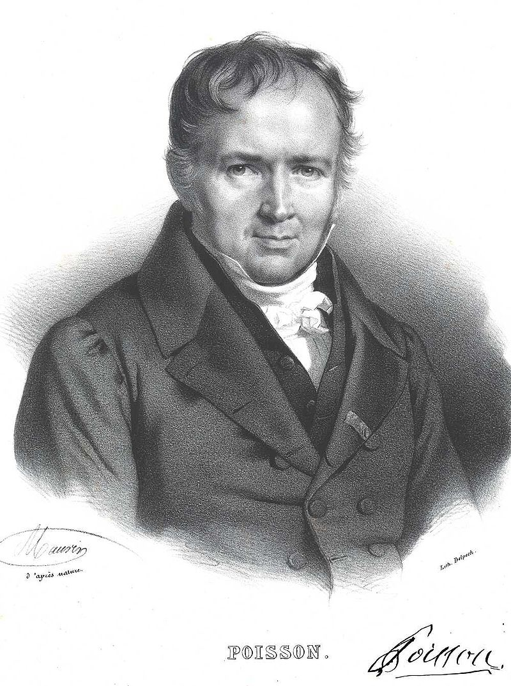
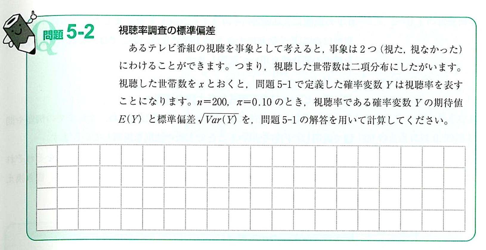

# 

<xlarge>

統計学B

</xlarge>

Week 7

# 大数の法則
The law of large numbers

　

## え？どういうこと？

すなわち、何かをくり返いしやり続けたら、
それを多く繰り返すことによっていわゆる「期待値」に近づく！

## 確率変数の期待値

The expected value of a random variable

## （１）確率変数の関数

## 確率変数の期待値p59

- 確率変数𝑋の観測値𝑥に 確率Pr⁡(𝑋=𝑥)または確率密度関数𝑓(𝑥)を 乗じたものの総和
- <red>確率変数と確率の積和</red>（確率分布の平均値と同じ）

## 期待値？Expected value? Huh?
What is the average outcome (expected value) when you role a dice?
<large>🎲</large>

##
<large>🎲</large>
<medium>
$E(X)=\frac{(1+2+3+4+5+6)}{6}=3.5$
</medium>

##

### 教科書の式でやると：

<medium>

$\sum xPr(X=x)$

</medium>

         
<!--  -->

## 確率変数の分散p59

- 確率変数の関数として$𝑔(𝑋)=(𝑋−𝜇_𝑥 )^2$とすると

- 確率分布の分散と同じ
- 確率分布の平均値と分散は
<red>期待値の特別な形式

##
<large>🎲</large>

## <medium>🎲</medium> 大数の法則を証明しょう! <medium>🎲</medium>

<xl>
❶
</xl>

<medium>2個のサイコロを振ったときの期待値は?</medium>

hint: $𝐸(𝑋+𝑌)=𝐸(𝑋)+𝐸(𝑌)$

##

<xl>
❷
</xl>

2 つのサイコロを5回、そして10回振ってそれぞれの平均を記録しよう

ここでサイコロを振ってね：
https://jp.piliapp.com/random/dice/?num=2

##
<xl>
❸
</xl>

Let's simulate it in Python

## （３） 期待値の基本的な性質 p59-63

## <large>🤷🏻‍♀️🤷🏻</large>

## 期待値の基本的な性質①

- 𝑋と𝑌	：確率変数
𝑎と𝑏		：定数

<medium>

$𝐸(𝑎𝑋+𝑏)=𝑎𝐸(𝑋)+𝑏$

</medium>

- 定数（𝑎と𝑏）は確率変数ではないので
対応する確率は存在しない

## 期待値の基本的な性質②

- 𝑋と𝑌	：確率変数
𝑎と𝑏		：定数

<medium>

$𝐸(𝑋+𝑌)=𝐸(𝑋)+𝐸(𝑌)$

</medium>

- 確率変数の和の期待値は
期待値の和と同じ
- 𝑋と𝑌が独立でなくても成り立つ

## Example $E(X+Y)$

**例: 公平なコインを2回投げる**

- 2つの公平なコインを持っており、$X$ と $Y$ という2つの確率変数に興味があります。ここで：
  - $X$ は、最初のコインを投げたときに得られる表の数を表します。
  - $Y$ は、2番目のコインを投げたときに得られる表の数を表します。
 
- $X$ と $Y$ はともに0（表が出ない）から1（表が1回出る）までの値を取り、各結果は等しい確率で発生します。

##

**期待値の線形性を利用:**

<gray>$E(X + Y) = E(X) + E(Y)$</gray>

- まず、$X$ の期待値 $E(X)$ を計算します。$X$ は、最初のコインを投げたときに表が出る回数を表し、各コイン投げにおいて表が出る確率（成功確率 $p$）は0.5（各コインが表または裏のどちらかが出る確率が同じ）です：

<gray>$E(X) = p = 0.5$</gray>

- 同様に、$E(Y)$ も0.5です。これは、$Y$ が2番目のコインを投げたときに表が出る回数を表し、同じ確率分布に従うためです。
##
- そして、線形性の性質を用いて $E(X + Y)$ を計算します：

  - <gray>$E(X + Y) = E(X) + E(Y) = 0.5 + 0.5 = 1$</gray>
 
- したがって、この例における $E(X + Y)$ は1です。これは、2つの公平なコインを投げて表の合計回数を数えると、平均して1回表が出ることを意味します。

## 期待値の基本的な性質③

- 𝑋と𝑌	：確率変数
𝑎と𝑏		：定数

<medium>

$𝑉𝑎𝑟(𝑎𝑋+𝑏)=𝑎^2 𝑉𝑎𝑟(𝑋)$

</medium>

- 分散は散らばりを表すため
定数𝑏が加えられても分散は変わらない

## 期待値の基本的な性質④

- 𝑋と𝑌	：確率変数
𝑎と𝑏		：定数

$𝑉𝑎𝑟(𝑋)=𝐸[(𝑋−𝐸(𝑋))^2 ]=𝐸(𝑋^2 )−[𝐸(𝑋)]^2$

- 分散は期待値の特別な形式
期待値を用いて書き直すことができる

## 期待値の基本的な性質⑤

- 𝑋と𝑌	：確率変数
𝑎と𝑏		：定数

<medium>

$𝐸(𝑋𝑌)=𝐸(𝑋)𝐸(𝑌)
$

</medium>

- 𝑋と𝑌が<red>独立</red>である場合のみ成り立つ

## 期待値の基本的な性質⑥

- 𝑋と𝑌	：確率変数
𝑎と𝑏		：定数

<medium>

$𝑉𝑎𝑟(𝑋+𝑌)=𝑉𝑎𝑟(𝑋)+𝑉𝑎𝑟(𝑌)$

</medium>

- 𝑋と𝑌が<red>独立</red>である場合のみ成り立つ

## （４） 二項分布にしたがう確率変数の期待値 p63

##
- 確率変数𝑋が二項分布にしたがう	：𝑋~𝐵(𝑛, 𝜋)
  - 期待値
  <gray>$E(X) = n𝜋$</gray>
  - 分散
  <gray>$Var(X) = n𝜋(1-𝜋)$</gray>

  <plum>超重要！</plum>

##

## 練習問題

- 打率3割2分8厘（0.328）の野球選手が、今日の試合で5回打席に立つときのヒットの本数𝑥の確率を考える。ヒットの本数の期待値と分散を求めなさい。

  - 公式を用いて解くと簡単！
    - 期待値	𝐸(𝑋)=𝑛𝜋
    - 分散		𝑉𝑎𝑟(𝑋)=𝑛𝜋(1−𝜋)

## 練習問題

- 打率3割2分8厘（0.328）の野球選手が、今日の試合で5回打席に立つときのヒットの本数𝑥の確率を考える。ヒットの本数の期待値と分散を求めなさい。

  - 公式を用いて解くと簡単！
    - 期待値	𝐸(𝑋)=𝑛𝜋
    - 分散		𝑉𝑎𝑟(𝑋)=𝑛𝜋(1−𝜋)

## p. 64 問題5-1

## p. 64 問題5-1

- 確率変数𝑋が二項分布にしたがうとき確率変数𝑋の関数$𝑔(𝑋)=\frac{𝑋}{𝑛}$を確率変数𝑌とする
- 確率変数𝑌の期待値𝐸(𝑌)と分散𝑉𝑎𝑟(𝑌)を求めよ
  - 期待値の基本的性質aとcを使って解きます

- 基本的性質<plum>a</plum>より
<red>$𝐸(𝑌)=𝐸(\frac{𝑋}𝑛)=\frac{1}𝑛 𝐸(𝑋)=\frac{1}𝑛 𝑛𝜋=𝜋$
- 基本的性質<plum>c</plum>より
<red>$𝑉𝑎𝑟(𝑌)=𝑉𝑎𝑟(\frac{𝑋}𝑛)=\frac{1}{𝑛^2}  𝑉𝑎𝑟(𝑋)=\frac{1}{𝑛^2}  𝑛𝜋(1−𝜋)=\frac{1}𝑛 𝜋(1−𝜋)$

## ポアソン分布
Poisson Distribution

<large>
🤔
</large>

<medium>
<red>教科書に載ってないけど期末試験に出るぞ！
</medium>

## ポアソン分布

- Siméon Denis Poisson
- French mathematician
- 1781-1840
- ポアソン分布・ポアソン方程式などで知られるフランスの数学者、地理学者、物理学者

##

🥐

<xl>

ポアソン = poisson ≠ croissant

</xl>

## ポアソン分布の期待値と分散

- ポアソン分布
  - 確率分布の一つ
  - 離散確率分布である（0,1,2,3...)
  - 結果はゼロから無限 $(0\le X\le\infty)$
  - <red>どれくらい頻繁に何かが発生するかを表現する方法</red>
  - <red>ポアソン分布では期待値と分散は同じである！</red>

期待値 𝐸(𝑥)=𝑛𝜋
分散 𝑉𝑎𝑟(𝑥)=𝑛𝜋

## 応用問題

時間通り帰れるかな？

##

- あなたはコストコのレジで働いている。
- 5時までのシフトなので、10分前にレジをクローズして時間通りに帰れるようにしたい。
- 過去のデータから10分前なら平均で5人のお客さんが並んでいることがわかる。

##

<medium>❶</medium>
これから4:50になるところだけど、<red>ちょうど3人</red>並んでいる確率は？
<medium>❷</medium>
<red>5人以上</red>並んでいる確率は？

##

ポアソンで分かること

<large>

$\lambda = \frac{回数}{時間帯}$

</large>
"lambda"はポアソンの平均と分散

##

ポアソンで分かること

<medium>

$E(X) = 期待値 = \mu = \lambda = 5$
$𝑉𝑎𝑟(X) = 分散 = \sigma^2  = 5$

</medium>

##
<red>ポアソン分布関数は</red>

<medium>

$Pr⁡(𝑥)=\frac{(\lambda^𝑥 𝑒^{-\lambda})}{𝑥!}$

</medium>

「e」は数学的な定数であるオイラー数（Euler's number）を表し、
おおよそ2.71828と等しい値

## <medium>❶</medium> これから5:00になるところだけど、<red>ちょうど3人</red>並んでいる確率はなんでしょう？

<medium>

$Pr⁡(𝑥)=\frac{(\lambda^𝑥 𝑒^{-\lambda})}{𝑥!}$

$Pr⁡(3)=\frac{(5^3 𝑒^{-5})}{3!}=0.140$

</medium>

## 計算ムズッ！🥶

## ポアソン分布表1

## ポアソン分布表2

##

## <medium>❷</medium> <red>5人以上</red>並んでいる確率は？
5人以上を計算するには４人以下のそれぞれの確率を足して、１から引く！

<!-- <medium> -->

$1-(P(0)+P(1)+P(2)+P(3)+P(4))$

$1-(0.007+0.034+0.084+0.140+0.175) = 1-0.44 = 0.56$

</medium>

## まとめ

<medium>❶</medium>
<red>ちょうど3人</red>並んでいる確率は？（早く帰れる🥳）

<medium>
14%
</medium>

<medium>❷</medium><red>
5人以上</red>並んでいる確率は？(すなわち、時間通りに帰れないない😭)

<medium>
56%
</medium>

## 練習問題

このデータを元に常磐線では平均で月1.5回の人身事故があるとする。
事故数を$x$とすると、その確率分布はポアソン分布で近似できるものとする。

<medium>

$\lambda = 1.5$

</medium>

## 

No|質問
--|:--
❶|人身事故の数の期待値と分散を求めなさい
❷|確率分布関数を示しなさい
❸|人身事故が一つも起こらない確率を求めなさい
❹|人身事故が4回以上起こる確率を求めなさい

      

## p65 問題5-2

## p65 問題5-2

- あるテレビ番組の視聴を事象とすると
事象は2つ（視た・視なかった）なので
視聴した世帯数は二項分布にしたがう
- 視聴した世帯数を𝑥とおくと
問題5-1で定義した確率変数𝑌は
視聴率を表す
- 𝑛=200, 𝜋=0.10のときの
視聴率の期待値と標準偏差を求めよ

##
- 問題5-1より
  - 期待値
<gray>$𝐸(𝑌)=𝜋=0.10$

  - 分散
<gray>$𝑉𝑎𝑟(𝑌)=\frac{1}{𝑛} 𝜋(1−𝜋)=\frac{1}{200}×0.10×0.90=0.00045$

  - 標準偏差
<gray>$\sqrt{𝑉𝑎𝑟(𝑌)} =\sqrt{0.00045}=0.0212$

## 第5章のまとめ

- 確率変数の期待値
  - 確率変数と確率の積和
  - 確率分布の平均値と分散は期待値の特別な形式
    - 確率分布を特定できれば期待値を求めることができる
- <red>確率変数が二項分布にしたがうとき
  - 期待値		𝐸(𝑋)=𝑛𝜋
  - 分散		𝑉𝑎𝑟(𝑋)=𝑛𝜋(1−𝜋)
- 大数の法則
  - 標本の大きさnを大きくしたときに
  標本の状況が母集団の状況に近づくこと
