

# 

<xlarge>

統計学B

</xlarge>

Week 8

#
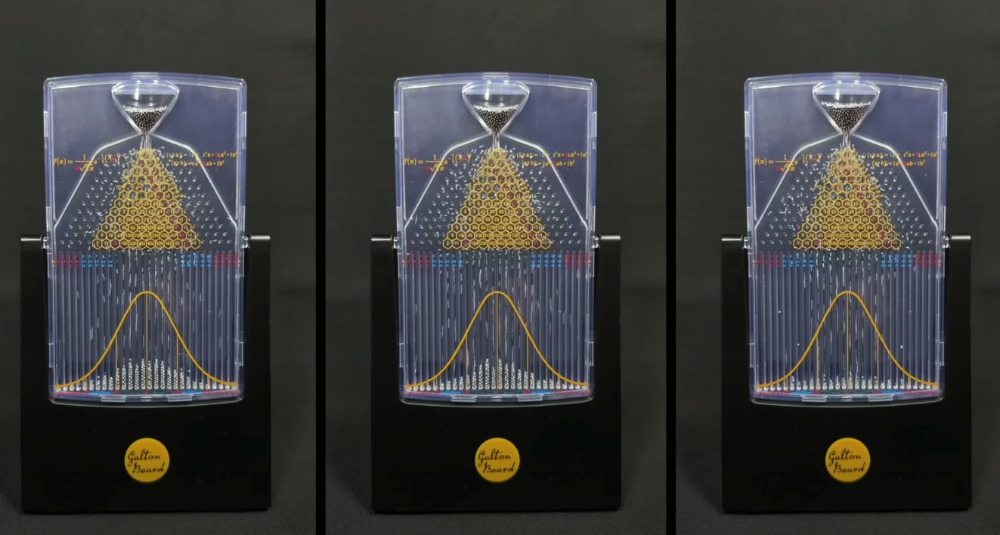

<large style="color:white">

The Galton Board

</large>

#

- Sir Francis Galton (1822-1911)
- British mathematician
- invented the "Galton Board"
- regression to the mean, or "reversion to mediocrity"
- 回帰先平均
(ex: test scores, heights, sports)
#

[Source: YouTube](https://youtu.be/zeJD6dqJ5lo?si=p_QH2d34KhYVgIPS&t=114)

#
<large>

中心極限定理

</large>

Central Limit Theorem
- The <red>Central Limit Theorem</red> is an essential theorem in statistics and probability theory. This theorem states that the sum or average of a large number of independent and identically distributed random variables tends to follow an approximate normal distribution, regardless of the original probability distribution of those variables. The Central Limit Theorem is a crucial property in statistics and data analysis.

## 標本平均の分布 p71
the sampling distribution of the sample mean

## クイズ６（p70）

##

## p75

##

Let's think about the dice rolls we did last week.

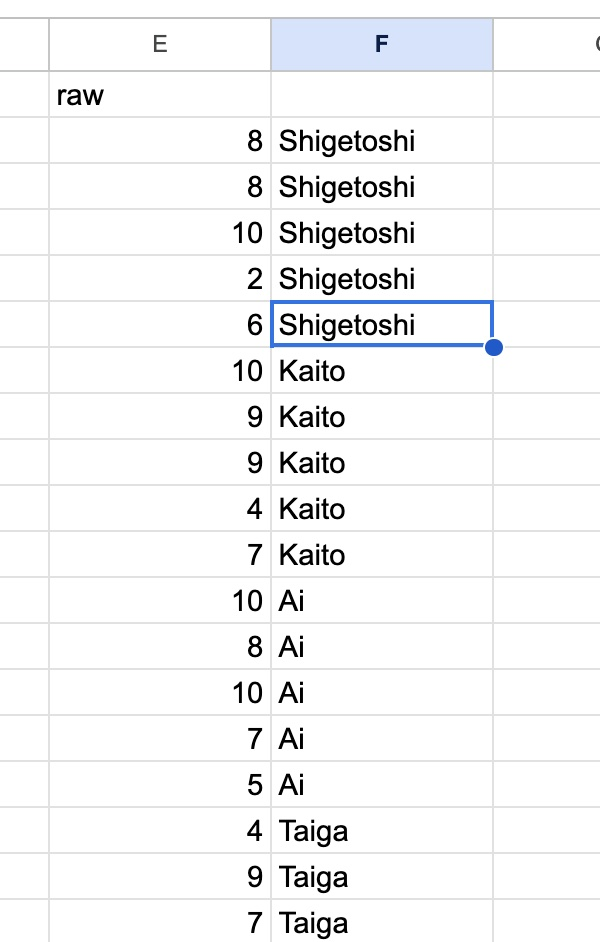

##
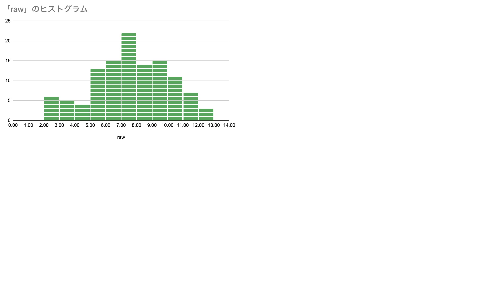

##
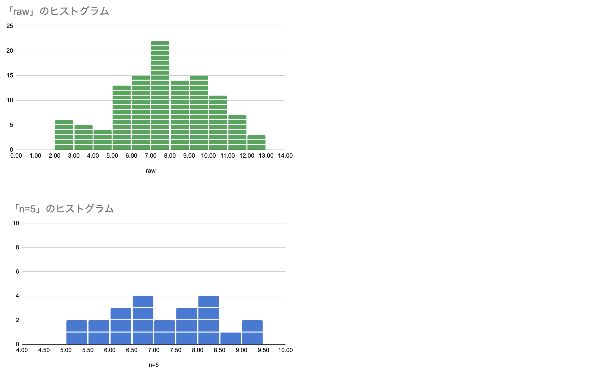

##
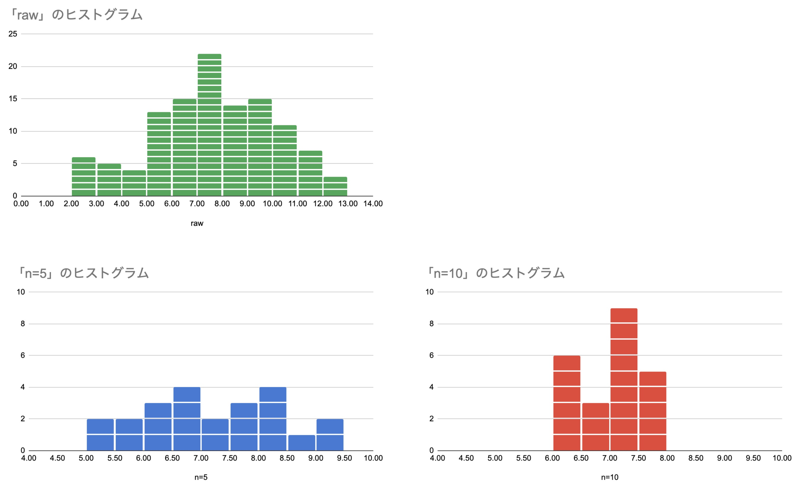

##

Simulate in python

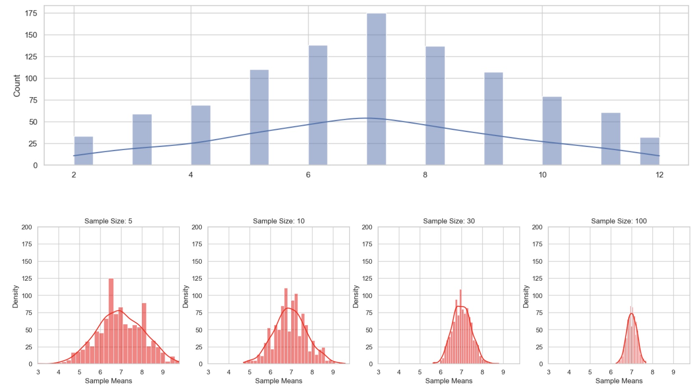

##

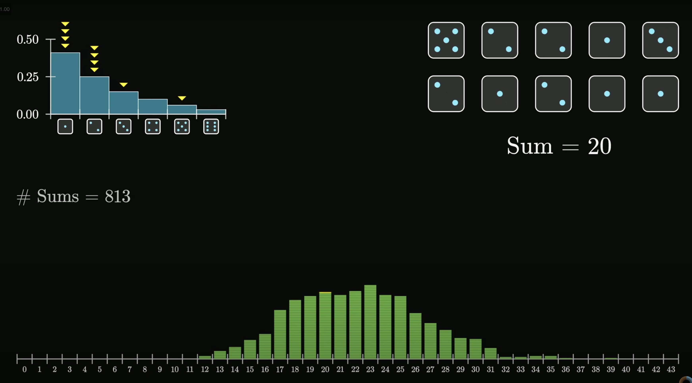
https://youtu.be/zeJD6dqJ5lo?si=EVliaDlad-7XeVHp&t=369

<!-- ## （１）確率変数 $𝑋_𝑖$ p71
random variable -->

<!-- 
### 確率変数 $𝑋_𝑖$

- 標本の観測値 $𝑥_𝑖$ は
確率変数 $𝑋_𝑖$ として表すことができる
 
  - 母集団での比率𝜋がわかれば確率 
  <gray>$Pr⁡(𝑋=𝑥) =_𝑛 𝐶_𝑥 𝜋^𝑥 (1−𝜋)^{𝑛−𝑥}$</gray>
 
  - 母集団からランダムに抽出した標本は
<red>母集団と同じ確率分布をもつ</red>と考えると
標本の観測値 $𝑥_𝑖$ を確率変数 $𝑋_𝑖$ とみなすことができる -->
<!-- 
### 確率変数 $𝑋_𝑖$

- 標本の観測値 $𝑥_𝑖$ は
確率変数 $𝑋_𝑖$ として表すことができる

  - 確率変数 $𝑋_𝑖$ は確率変数𝑋と<red>同じ確率分布にしたがう
  - それぞれの<red> $𝑿_𝒊$ は独立</red>である

    - 母集団から標本を抽出したとしても
母集団の分布である<red>確率分布は変化しない</red>ため -->

## （２）標本平均の分布 p72

the sampling distribution of the sample mean

##

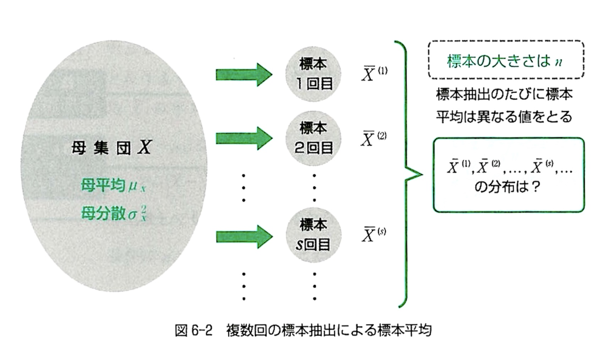

### 標本平均の分布

- 標本における観測値 $𝑥_1$, $𝑥_2$, …, $𝑥_𝑛$を
確率変数として $𝑋_1$, $𝑋_2$, …, $𝑋_𝑛$とする
  - 関数𝑔($𝑋_1$, $𝑋_2$,…, $𝑋_𝑛$ )

- 標本平均
<medium><gray>$\bar{𝑋}=\frac{1}𝑛 ∑𝑋_𝑖$
  - 確率変数の関数
    - 標本平均自体が確率変数であるといえる
<!-- 
### 標本平均の分布

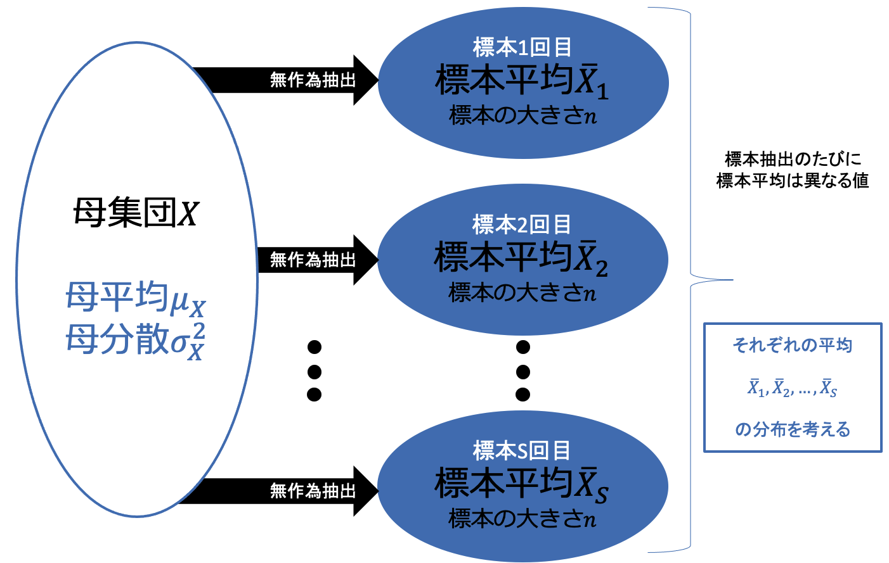 -->

## （３）標本平均 $\bar{X}$の平均値と分散p73

Mean and Variance of the Sample Mean $\bar{X}$

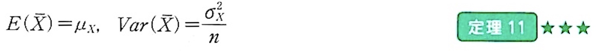

<!-- 
### 標本平均$\bar{X}$の平均値と分散

- 母集団$𝑋$
    - 母平均 $𝜇_𝑋$
    - 母分散 $𝜎_𝑋^2$
- 期待値として表すと
  - 平均𝐸(𝑋)= $𝜇_𝑋$
  - 分散 $𝑉𝑎𝑟(𝑋)=𝜎_𝑋^2$
 
- この母集団から大きさ$𝑛$の標本を無作為抽出
  - 確率変数$𝑋_𝑖$は確率変数$𝑋$と同じ確率分布にしたがうので
  - $𝐸(𝑋_𝑖 )=𝜇_𝑋$
  - $𝑉𝑎𝑟(𝑋_𝑖 )=𝜎_𝑋^2$ -->

### 標本平均$\bar{X}$の平均値

- 母集団$𝑋$
    - 母平均 $𝜇_𝑋$
    - 母分散 $𝜎_𝑋^2$
- 期待値として表すと
  - 平均𝐸(𝑋)= $𝜇_𝑋$
  - 分散 $𝑉𝑎𝑟(𝑋)=𝜎_𝑋^2$
- 平均値 $𝐸(\bar{𝑋})=𝜇_𝑋$
  - <red>母平均と同じになる
  - つまり、平均的に標本平均($\bar{X}$)は母集団の平均 $μ$ と等しいです。
  - on average, the sample mean ($\bar{X}$) is equal to the population mean ($μ$)

### 標本平均$\bar{X}$の分散

<medium>$𝑉𝑎𝑟(\bar{𝑋})=\frac{𝜎_𝑋^2}𝑛$
- 分散 

  - 母分散の <red>$\frac{1}𝑛$倍

   ここで：
   - $\sigma^2$ は母集団の分散です。
   - $n$ は標本のサイズです。

   この数式から、標本平均 $\bar{X}$ の<red>分散は標本サイズ ($n$) が増加するにつれて減少</red>することがわかります。つまり、より大きな標本は、母集団の平均 $\mu$ に近い標本平均を生成する傾向があります。

### 標本平均$\bar{X}$の標準偏差

- 分散 $𝑉𝑎𝑟(\bar{𝑋})=\frac{𝜎_𝑋^2}𝑛$なので、
標準偏差は

<medium>

$標準偏差=\frac{𝜎_𝑋}{\sqrt{𝑛}}$

</medium>

## p76 問題6-1

## p76 問題6-1

【難】標本調査の精度

- 無限母集団から
標本を無作為抽出して調査を行う。
  - 標本の大きさ𝑛=200のとき
標本平均の標準偏差は理論的には$\frac{𝜎_𝑥}{\sqrt{200}}$
  - 調査の規模を10倍（n=2000）にしたとき
調査の精度は10倍になるか？

    - 標本平均の標準偏差の大きさを調査精度と考える
    - 標本平均の標準偏差は𝑛=200のときの何割程度になるか
    - もしも調査の精度が10倍になるなら
    - 標本平均の標準偏差（ばらつき）は0.1程度になるはず

## p76 問題6-1

- 標本の大きさを10倍にしても調査の精度は10倍にはならない
  - <red>標準偏差は𝟏/𝟏𝟎にはならない</red>
<medium><gray>$\frac{𝜎_𝑋}{\sqrt{200}}:\frac{𝜎_𝑋}{\sqrt{2000}}=1:\frac{1}{\sqrt{10}}=1:0.316$
</gray></medium>

- より、標準偏差は30%程度
  - 標本の大きさを100倍したときに
$\frac{1}{\sqrt{100}}=\frac{1}{10}$より、標準偏差は10%程度となり、調査精度は10倍になる

- 標本が大きければ大きいほど
標本は母集団に近づくが<red>比例するわけではない</red>ことに注意！

# 中心極限定理

## 中心極限定理

<plum>超重要!</plum>
- 中心極限定理
  - 母集団がどのような分布であっても無作為抽出した標本における和の分布は標本の大きさ𝑛が大きいときに<red>正規分布</red>になる
↓
    - 標本平均について言い換えると
  - 母集団がどのような分布であっても無作為抽出した標本における標本$\bar{𝑿}$の分布は標本の大きさ𝑛が大きいときに

<red>平均 $𝝁_𝑿$　分散 $\frac{𝝈_𝑿^𝟐}𝒏$　の正規分布になる</red>

- 標本平均がある範囲内に含まれる確率を、
正規分布を用いて計算することが可能になる

## 正規分布（normal distribution）

連続確率変数𝑋の確率密度関数𝑓(𝑥)が

<medium>$𝑓(𝑥)=\frac{1}{\sqrt{2𝜋𝜎_𝑋^2}}   exp⁡\{−\frac{(𝑥−𝜇_𝑋 )^2}{2𝜎_𝑋^2}\}$</medium>

となるときの𝑋の確率分布

- <red>$𝑋\sim𝑁(𝜇_𝑋, 𝜎_𝑋^2 )$
- <red>平均を中心</red>として<red>左右対称の連続確率分布

## 正規分布（normal distribution）

- <red>$𝑋\sim𝑁(𝜇_𝑋, 𝜎_𝑋^2 )$
- <red>平均を中心</red>として<red>左右対称の連続確率分布

## 正規分布（normal distribution）

- <red>$𝑋\sim𝑁(𝜇_𝑋, 𝜎_𝑋^2 )$
- <red>平均を中心</red>として<red>左右対称の連続確率分布

## 正規分布（normal distribution）

- <red>$𝑋\sim𝑁(𝜇_𝑋, 𝜎_𝑋^2 )$
- <red>平均を中心</red>として<red>左右対称の連続確率分布

## Practice Exercise
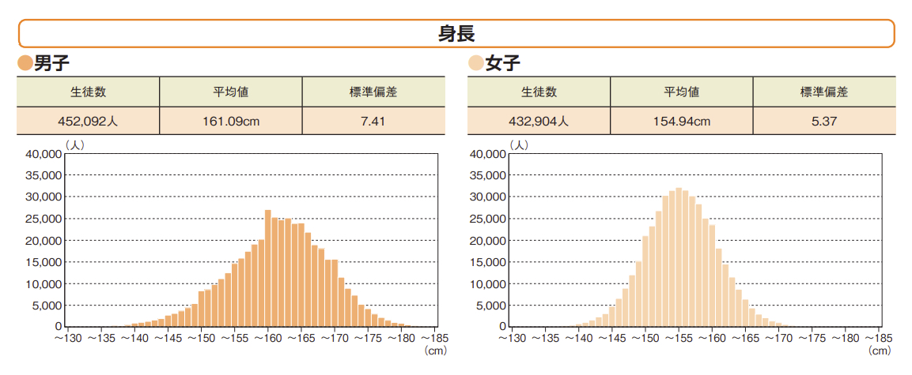
[スポーツ庁の令和4年度全国体力・運動能力、運動習慣等調査結果](https://www.mext.go.jp/sports/b_menu/toukei/kodomo/zencyo/1411922_00004.html)

### 無作為で`50`人の女子中学生を選出したら、平均身長が160cmから165cmの間にある確率は？
$Pr(160cm > \bar{X} > 165cm)$

## 標準化する（Z値を求める）

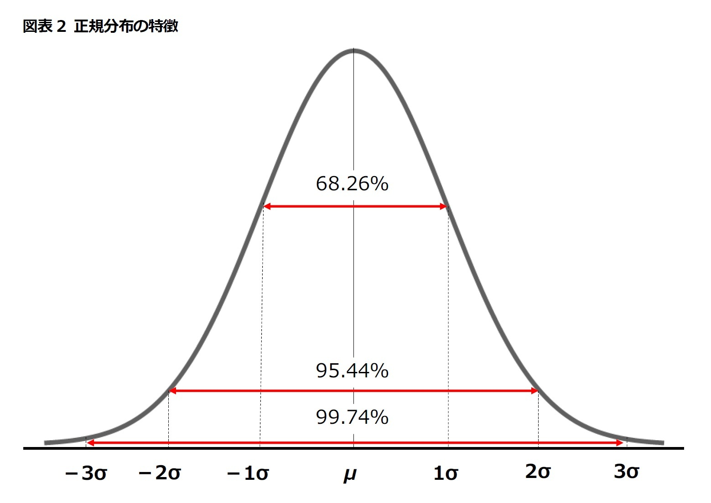

##

<medium>

$Z = \frac{X-\mu}{\sigma}$

</medium>

160cmのZ値は

<medium>

$Z_{160} = \frac{(160-154.94)}{5.37}=$ &nbsp;&nbsp;&nbsp;&nbsp;&nbsp;&nbsp;&nbsp;&nbsp;&nbsp;&nbsp;

</medium>

165cmのZ値は

<medium>

$Z_{165} = \frac{(165-154.94)}{5.37} =$ &nbsp;&nbsp;&nbsp;&nbsp;&nbsp;&nbsp;&nbsp;&nbsp;&nbsp;&nbsp;

</medium>

### 

上の表に160cmと165cmのZ値の範囲を示して塗りつぶす

### 標準正規分布表でLook up!

$Pr(Z>0.94) =$&nbsp;&nbsp;&nbsp;&nbsp;&nbsp;&nbsp;&nbsp;&nbsp;&nbsp;&nbsp;&nbsp;&nbsp;&nbsp;&nbsp;&nbsp;&nbsp;&nbsp;&nbsp;
 

$Pr(Z>1.87) =$&nbsp;&nbsp;&nbsp;&nbsp;&nbsp;&nbsp;&nbsp;&nbsp;&nbsp;&nbsp;&nbsp;&nbsp;&nbsp;&nbsp;&nbsp;&nbsp;&nbsp;&nbsp;

### 最後の計算

よって、平均身長が160cmから165cmの間にある確率は&nbsp;&nbsp;&nbsp;&nbsp;&nbsp;&nbsp;&nbsp;&nbsp;&nbsp;&nbsp;%

##

### 🏃🏻🏃🏻‍♂️ 全国の中学生の男子の５０m走の平均値は`8.06`〠標準åå·®ã¯`1.07`である。

無作為で`50`人の男子中学生を選出したら、
その`50`人の平均値が`6秒`から`7秒`の間にある確率は？

### 

###

# 第6章のまとめ
<small>

- 標本の観測値$𝑥_𝑖$を確率変数$𝑋_𝑖$として表す
  - 標本平均 $\bar{𝑋}$
  - 標本平均に関する平均値 $𝐸(\bar{𝑋})=𝜇_𝑋$
  - 標本平均に関する分散 $𝑉𝑎𝑟(\bar{𝑋})=\frac{𝜎_𝑋^2}𝑛$
- 標本の大きさ𝑛を大きくしたとき
標本平均は母平均に近づく
- 中心極限定理
  - 母集団の分布がどのような分布であっても
  無作為抽出した標本における標本平均は
  標本の大きさ𝑛が大きいときに正規分布にしたがう
- 正規分布
  - 中心は平均
  - 左右対称
  - 連続確率分布