

# 

<xlarge>

統計学B

</xlarge>

Week 8

# 母数の点推定

Point estimation of a population parameter

##

- English:
Point estimation of a population parameter involves using sample data obtained from the population to estimate a specific parameter or value of the population. Common point estimators include the sample mean (for estimating the population mean), sample proportion (for estimating the population proportion), and sample variance (for estimating the population variance). These estimators provide a single, best guess for the true population parameter based on the available sample data.

##

- Japanese (日本語):
母数の点推定は、母集団から得られたサンプルデータを使用して、母集団の特定のパラメータや値を推定するプロセスを指します。一般的な点推定量には、標本平均（母集団平均を推定するためのもの）、標本比率（母集団比率を推定するためのもの）、標本分散（母集団分散を推定するためのもの）などがあります。これらの推定量は、利用可能なサンプルデータに基づいて、真の母数パラメータに対する単一の最良の予測を提供します。

## 母数と統計量

Population parameter and statistical parameter

###

1. **Population Parameter (母数):**
   - A population parameter is a characteristic or value that describes a specific aspect of a population. It is a fixed, unknown quantity that you want to estimate or learn more about.
   - Examples of population parameters include the population mean (μ), population variance (σ²), population standard deviation (σ), population proportion (π), and many others.
   - Populations parameters are typically unknown because it is often impractical or impossible to collect data from an entire population. Statistical techniques are used to estimate these parameters from a sample of the population.

###
2. **Statistical Parameter (統計量):**
   - A statistical parameter, also known as a sample statistic, is a characteristic or value calculated from a sample of data. It is used to estimate or infer information about the corresponding population parameter.
   - Examples of statistical parameters include the sample mean (x̄), sample variance (s²), sample standard deviation (s), sample proportion (p̂), and others.
   - Statistical parameters provide information about the sample and are used as estimators or statistics to make inferences about the population parameters. They are known and calculable based on the data collected from the sample.
###
1. **母数（Population Parameter）:**
   - 母数は、母集団の特定の側面を記述する特性や値です。これは、推定または詳細を知りたい固定された未知の数量です。
   - 母数の例には、母集団平均（μ）、母集団分散（σ²）、母集団標準偏差（σ）、母集団比率（π）などがあります。
   - 母数は通常、母集団全体からデータを収集することがしばしば不可能または実用的でないため、統計的な手法を使用して母数を推定します。
###
2. **統計量（Statistical Parameter）:**
   - 統計量、または標本統計量としても知られるものは、データの標本から計算された特性または値です。これは、対応する母数についての情報を推定または推論するために使用されます。
   - 統計量の例には、標本平均（x̄）、標本分散（s²）、標本標準偏差（s）、標本比率（p̂）などがあります。
   - 統計量は標本に関する情報を提供し、母数についての推論を行うための推定量または統計として使用されます。データから計算可能で既知です。

### 母数と統計量

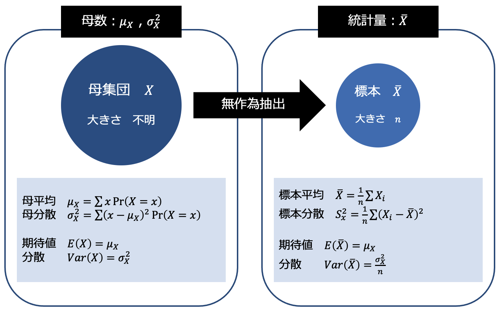

### 母数と統計量

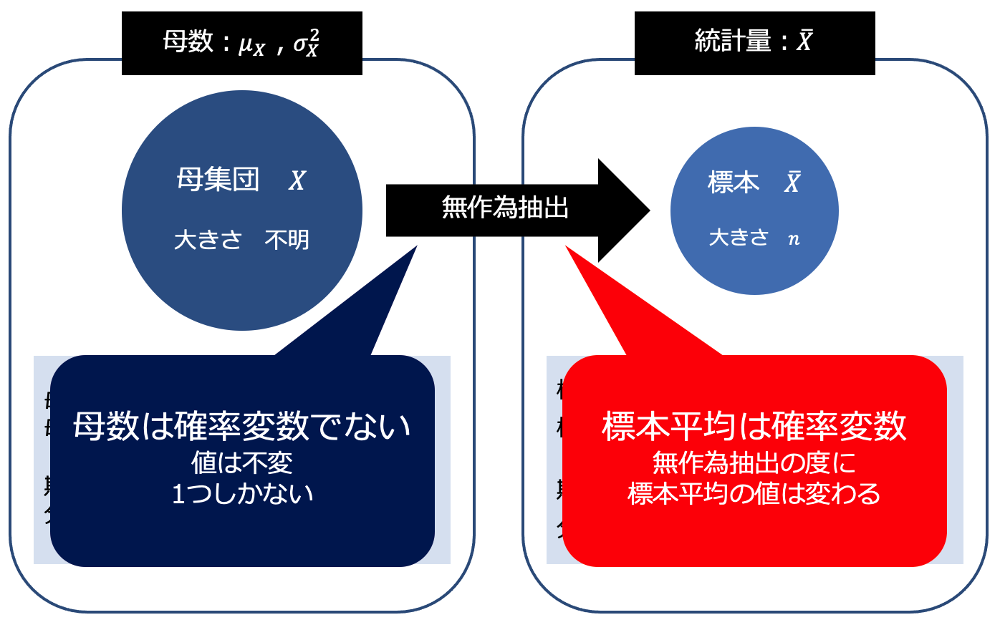

### 母数と統計量

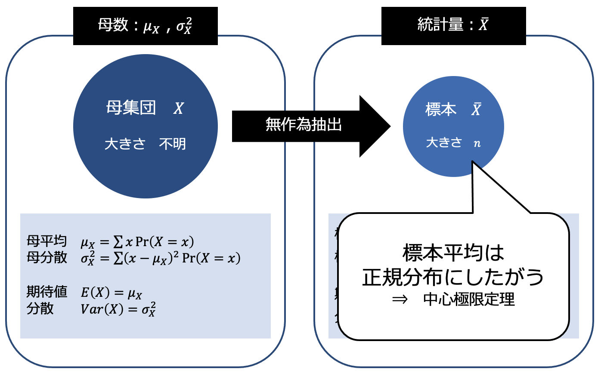

### 母数と統計量

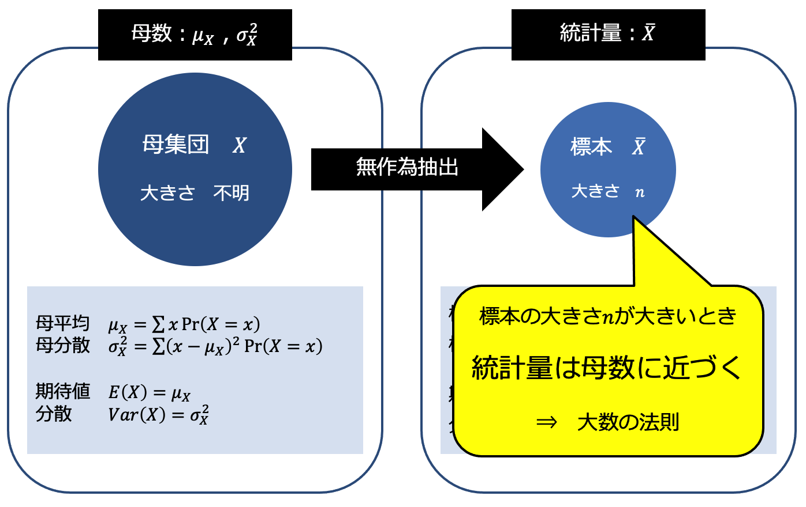

# 統計的推測における点推定と区間推定

Statistical inference: Point estimation and interval estimation

## （１） 推定量と推定値

Estimator and estimate

### 推定量と推定値

- 推定量 (estimator)
  - 母数を推定するための統計量
  - An estimator is a statistical function or formula used to calculate an estimate or prediction of an unknown population parameter based on sample data.
- 推定値 (estimate)
  - 統計データを代入して計算した値
  - An estimate is the actual numerical value that results from applying an estimator to a specific set of sample data.

## （２） 推定量の確率分布
Probability Distribution of an Estimator

### 推定量の確率分布

- 推定量は確率変数であるため、確率分布を考えることができる

- 最も良い推定量
$𝐸(\hat{𝜃}  )=𝜃$ かつ $𝑉𝑎𝑟(\hat{𝜃} )=0$
  - 母数		：$𝜃$
  - 推定量	：$\hat{𝜃}$
- $𝑉𝑎𝑟(\hat{𝜃})=0$ を満たす推定量は存在しない
  - 推定量の確率分布に散らばりが全くない状況は
    <red>標本抽出</red>においてはほぼ起こらないため
    - 推定量の確率分布に散らばりが全くないのなら「推定」は不要

## （３） 点推定と区間推定

Point estimation and interval estimation

### 点推定と区間推定

- 点推定
  - 推定量の分布における1つの値をもって
    母数を推定すること
    - 推定結果は1つの値
  - Point estimation is the process of calculating a single estimate value for a specific parameter of a population (e.g., mean, variance, proportion).

### 点推定と区間推定

- 区間推定
  - 推定量の確率分布における区間を用いて
    母数を推定すること
    - 推定結果は区間（○○以上●●以下）
    - 来週以降の内容（第9章、第10章）
  - Interval estimation provides a range of possible values within which a population parameter is likely to fall.

# 点推定量
Point estimator

## 

- A point estimator is a statistic or a mathematical function applied to sample data to estimate a specific population parameter.

- 点推定量（Point Estimator）は、特定の母集団パラメータを推定するために、標本データに適用される統計量または数学的な関数です。

## （１） 不偏性の性質

Unbiasedness

### 不偏性の性質

- 推定量として望ましい性質
- Unbiasedness is a desirable property of an estimator, indicating that, on average, the estimator's expected value equals the true value of the population parameter being estimated.
  - 不偏性
    - 母数𝜃に対する推定量 $\hat{𝜃}$ が $𝐸(\hat{𝜃})=𝜃$ を満たすとき
    - 推定量の期待値　＝　母数
  - 有効性
  - 一致性

### 不偏性の性質

- <red>不偏推定量（unbiased estimator）</red>
  - An unbiased estimator is a statistical estimator whose expected value is equal to the true population parameter it is estimating.
  - 不偏性をもつ推定量 $\hat{𝜃}$
  - 偏り（バイアス）のない推定量

## （２） 母平均の点推定量
The point estimator for the population mean

### 母平均の点推定量

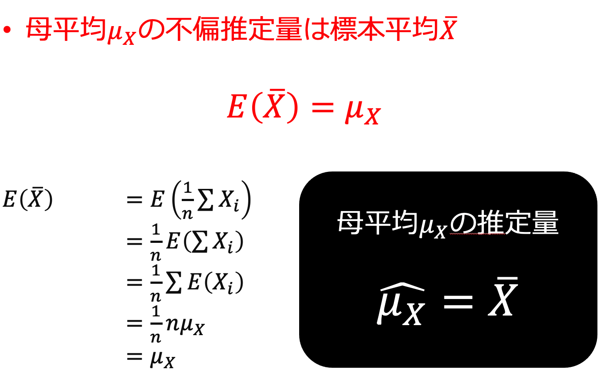

## （３） 母分散の点推定量

The point estimator for the population variance

### 母分散の点推定量

- 標本分散 $𝑆_𝑥^2$ は
母分散 $𝜎_𝑋^2$ の不偏推定量にはならない

  - <red>標本分散 $𝑆_𝑥^2$ の期待値 $𝐸(𝑆_𝑥^2 )$ は母分散に一致しないため
  - もし母分散 $𝜎_𝑋^2$ の推定量として
    $\frac{1}{𝑛} ∑(𝑋_𝑖−𝜇_𝑋 )^2$ を用いることができるなら
    
    $𝐸[\frac{1}{𝑛} ∑(𝑋_𝑖−𝜇_𝑋 )^2 ]=\frac{1}{𝑛} ∑𝐸[(𝑋_𝑖−𝜇_𝑋 )^2 ] = \frac{1}{𝑛} 𝑛𝜎_𝑋^2=𝜎_𝑋^2$

    となるため不偏推定量になる
  - しかし<red>母平均 $𝜇_𝑋$ は未知</red>であるため
    母平均 $𝜇_𝑋$ を推定量 $\hat{𝜇_𝑋}=\bar{𝑋}$ で置き換える必要がある

### 母分散の点推定量

- 標本不偏分散
  - 母分散 $𝜎_𝑋^2$ の不偏推定量

    <red> $\hat{𝜎_𝑋^2}=\frac{1}{𝑛−1} ∑(𝑋_𝑖−\bar{𝑋})^2$ 

    - 標本分散𝑆_𝑥^2の分母は𝑛だったが
      <red>標本不偏分散の分母は $𝑛−1$ であることに注意

### 母分散の点推定量

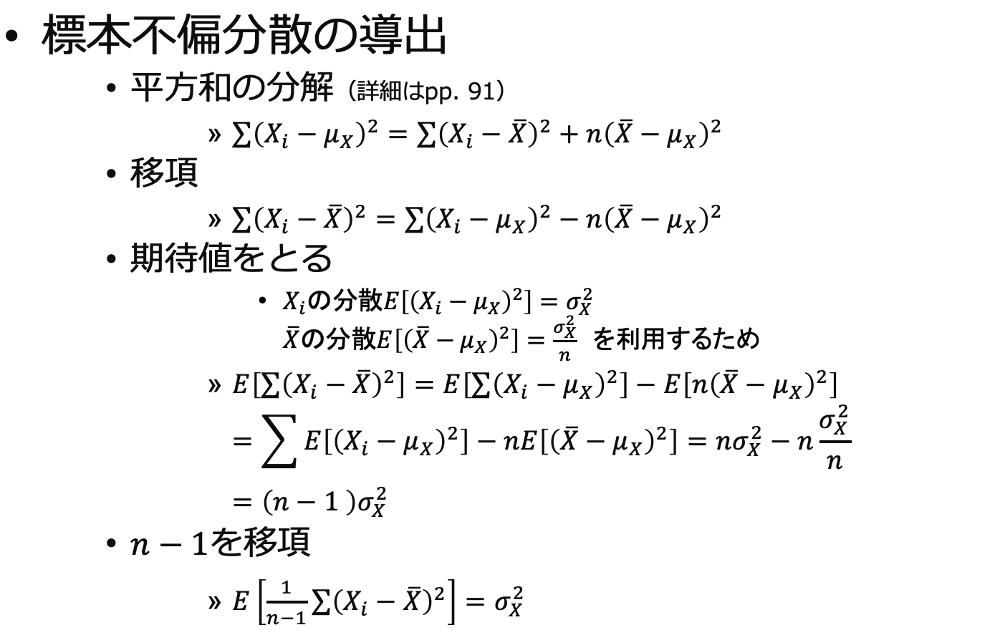

# 標本不偏分散を用いた標本平均の標準化
Standardization of sample mean using sample unbiased variance

## （１） 標本平均の標準化
Standardizing the sample mean

### 標本平均の標準化

- 標本平均 $\bar{𝑋}$ を標準化した確率変数 $𝑍$
  - 標準正規分布にしたがう
  $𝑍=\frac{\bar{𝑋}−𝐸(\bar{𝑋} )}{\sqrt{𝑉𝑎𝑟(\bar{𝑋}}}=\frac{\bar{𝑋}−𝜇_𝑋}{\sqrt{\frac{𝜎_𝑋^2}{𝑛}}}\sim𝑁(0, 1)$

- 𝑍には母数（母平均、母分散）が含まれている
- <red>母数は未知
  - 母分散の代わりに標本不偏分散を用いると
  その統計量は標準正規分布にはしたがわない
    - 別物になる

### 標本平均の標準化

- 母分散 $𝜎_𝑋^2$ の代わりに
標本不偏分散 $\hat{𝜎_𝑋^2}$を用いた確率変数𝑇

$$
𝑇=\frac{\bar{𝑋}−𝜇_𝑋}{\sqrt{\frac{\hat{𝜎_𝑋^2}}{𝑛}}}\sim 𝑡(𝑛−1)
$$

- 自由度 $𝑛−1$ のt分布にしたがう

## （２） t分布の定義

### t分布の定義
- The t-distribution is a probability distribution that is used in statistics to make inferences about population parameters when dealing with small sample sizes or when the population standard deviation is unknown.

- t分布（Studentのt分布）は、統計学で、標本サイズが小さい場合や母集団の標準偏差が未知の場合に、母集団パラメータに関する推論を行うために使用される確率分布です

### t分布の定義

- Other assumptions
  - assumes the underlying distribution is normal (ex. height)
  

### t分布の定義

- t分布（t-distribution）
  - 確率変数Zが標準正規分布 $𝑁(0,1)$にしたがい
    確率変数 $U$ が
    自由度𝜈のカイ二乗分布 $𝜒^2 (𝜈)$にしたがうとき
    確率変数Tは自由度 $𝜈$ のt分布 $𝑡(𝜈)$にしたがう

$$
𝑇=\frac{𝑍}{\sqrt{\frac{𝑈}{𝜈}}}\sim~𝑡(𝜈)
$$

### t分布の定義

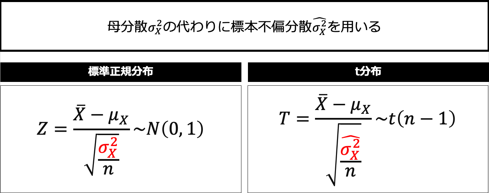

## （４） t分布の性質

### t分布の性質

- t分布
  - 左右対称の確率分布
  - 自由度𝜈の値により形状が変化
  - 自由度𝜈の値が大きいときに標準正規分布に近似する

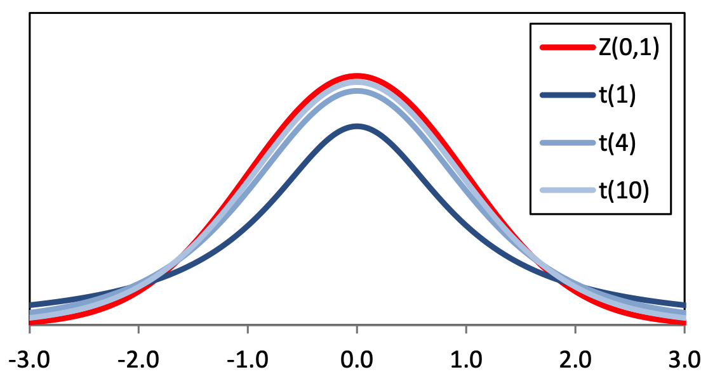

## （５） t分布表の見方

### t分布表の見方 <plum>超重要！</plum>

- t分布表
  - 教科書pp.163（付録3）
  - 表側（縦）	自由度 $𝜈$
  - 表頭（横）	上側確率 $𝛼$
  - 表中		自由度𝜈、上側確率 $𝛼$ に対応した
   			統計量 $𝑇$ の<red>パーセント点
   			<red>$𝑡_𝛼 (𝜈)$

### t分布表の見方

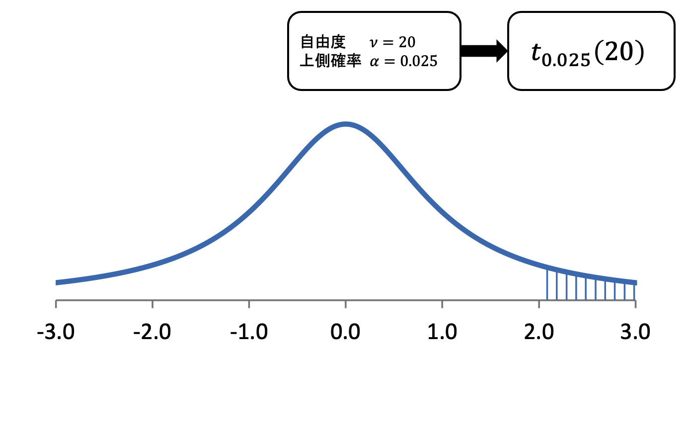

### t分布表の見方
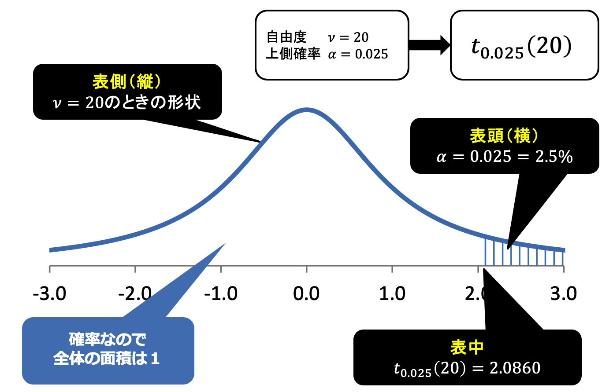

### t分布表の見方
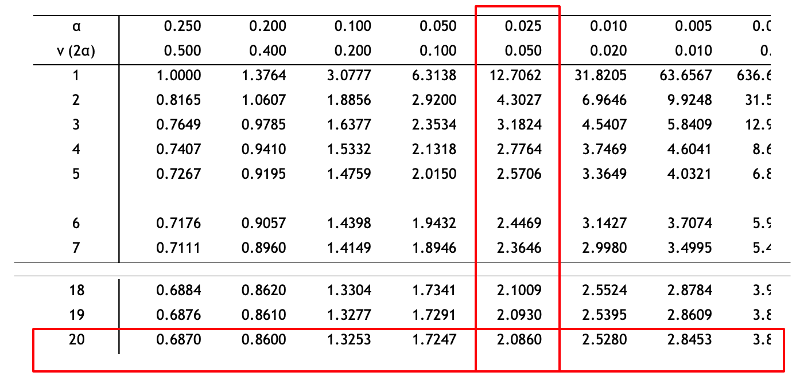

## （６） t分布表に基づく確率計算

### t分布表に基づく確率計算

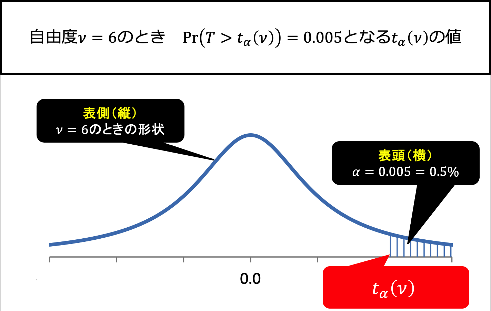

### t分布表に基づく確率計算

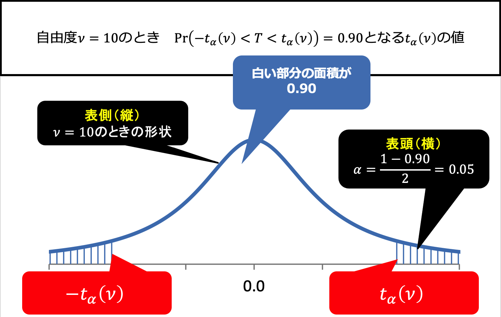

## 第8章のまとめ

<small>

- 母数の推測
  - 推定量	母数を推定するための統計量
  - 推定値	推定量に統計データを代入して計算した値
- 点推定
  - 1つの値をもって母数を推定すること
- 不偏推定量
  - 母平均 $𝜇_𝑋$ の不偏推定量	$\bar{𝑋}=\frac{1}{𝑛} ∑𝑋_𝑖$
  - 母分散 $𝜎_𝑋^2$ の不偏推定量	$\hat{𝜎_𝑋^2}=\frac{1}{𝑛−1} ∑(𝑋_𝑖−\bar{𝑋})^2$ 
- 標本不偏分散を用いた統計量Tはt分布にしたがう
- t分布
  - 左右対称の確率分布
  - 形状は自由度の値によって変化
  - 自由度が大きくなると標準正規分布に近似

</small>