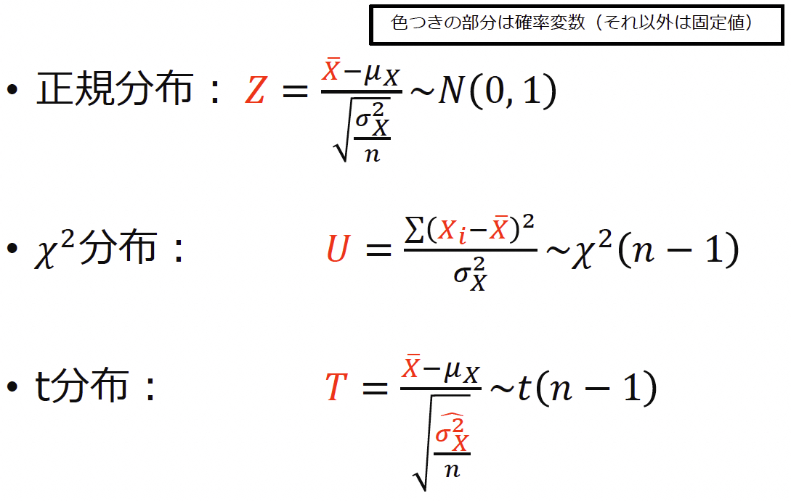
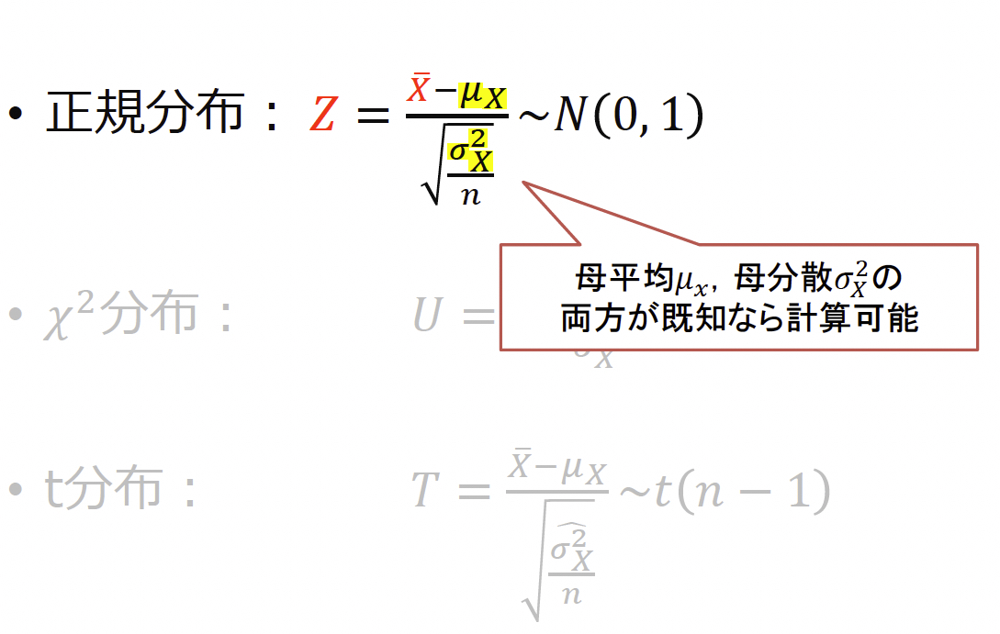
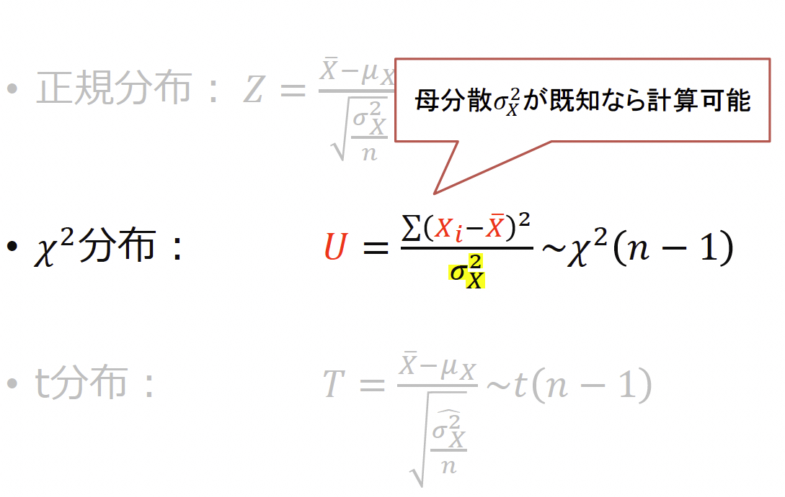
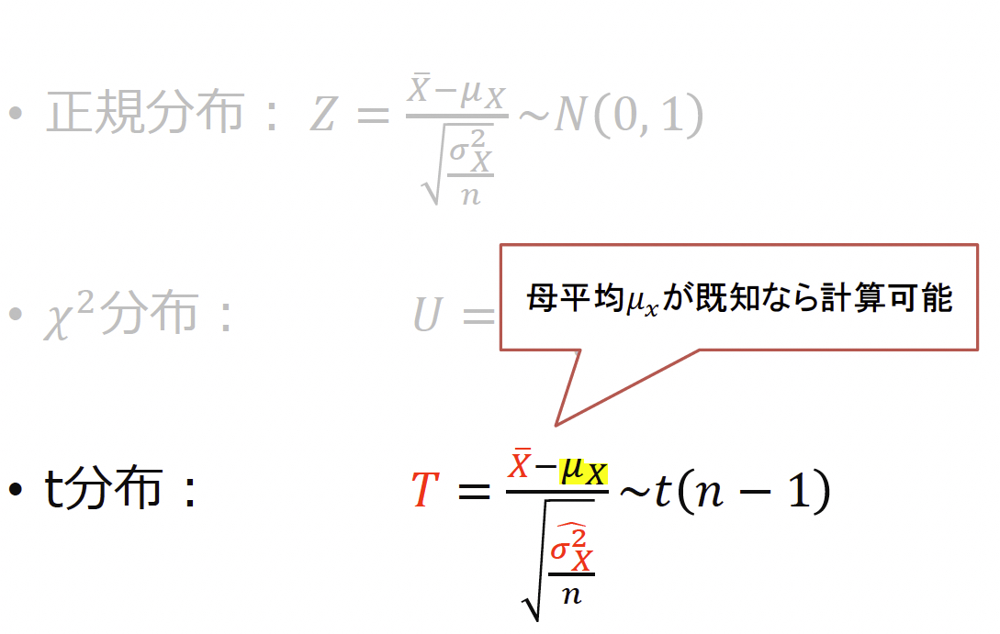
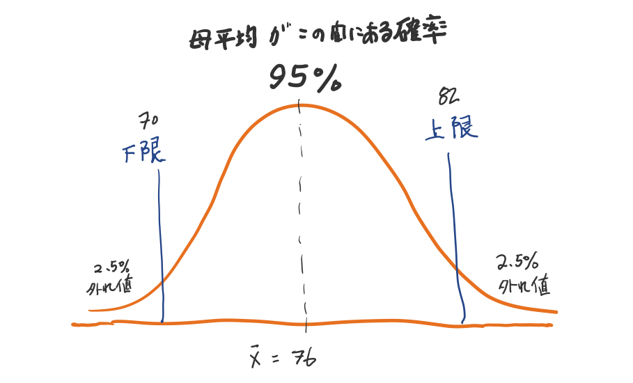
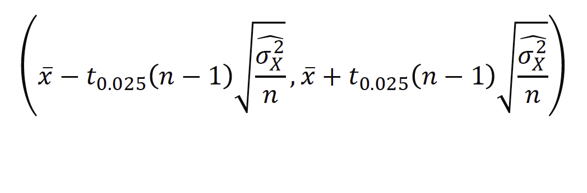
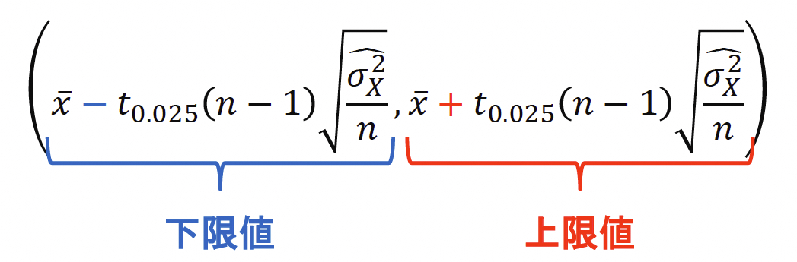
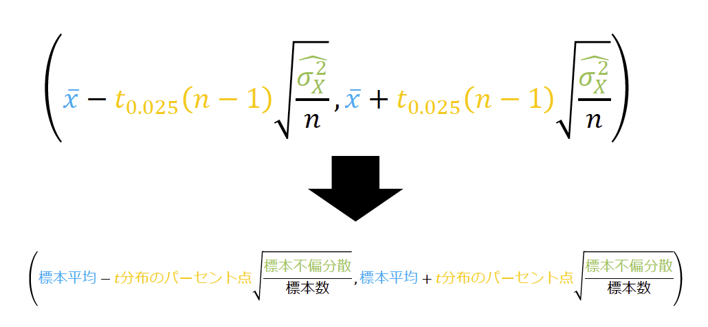

# 

<xlarge>
確率
統計学B

</xlarge>

Week 11

# Ch 9 母平均の区間推定

Confidence interval estimation for the population mean

## 収穫したマグロの平均重量は？

## サンプルで統計！

### サンプルの平均重量が50kg...

それってどれくらい信頼できるの？

### Well, it depends...

$n$の大きさ！

大きければ大きいほど信頼度は...
高い？低い？

## 信頼係数とは？

この区間に母集団の平均値が含まれているに違いない！

##

## p105 クイズ

## p105 クイズ

## p105 クイズ

## p105 クイズ

## 母平均の区間推定

- 区間推定
  - 推定量の確率分布における区間を用いて母数を推定
  - ある区間内に母数が含まれることを信頼度で示す

- 推定した区間
- 信頼係数$100(1−𝛼)\%$の信頼区間
  - 信頼係数 confidence coefficient
  - 信頼区間 confidence interval
- 信頼係数95%の信頼区間のことを
  <red>95% 信頼区間 ともいう</red>
– 信頼区間は（<red>下限値，上限値</red>） で表す

###

## 信頼区間

<medium>母平均$𝜇_𝑋$の 95% 信頼区間とは？</medium>

- ランダムな標本抽出を100 回繰り返し行って信頼区間を 100 回計算するとき区間内に母平均 𝜇𝑋を含むものは 100 回のうち 95 回程度になるような区間

### Pythonで検証！

### p109

###

###

###

## 母平均の区間推定に関する計算

### 例題9-1 p111

###
ポイントカード所有者2万人の母集団から50人を無作為抽出

標本数

<xl><b>50</b></xl>

標本平均
<xl><b>1.98</b></xl>

標本分散
<xl><b>2.6196</b></xl>

母平均の95% 信頼区間を求める

##

<medium>

$\textcolor{red}{\bar{\chi}}\pm t_{0.025}(n-1)\sqrt{\frac{{\hat{\sigma_x^2}}}{n}}$

</medium>

❶平均値

##

<medium>

$\textcolor{green}{1.98}\pm \textcolor{red}{t_{0.025}(n-1)}\sqrt{\frac{{\hat{\sigma_x^2}}}{n}}$

</medium>

❷ 95%信頼区間の場合：$\frac{1-0.95}{2}=\frac{0.05}{2}=0.025$

$\textcolor{red}{t_{0.025}(49)}=2.0096$ 

##

<medium>

$\textcolor{green}{1.98}\pm \textcolor{green}{2.0096}\sqrt{\frac{\textcolor{red}{\hat{\sigma_x^2}}}{n}}$

</medium>

❸標本不偏分散（赤い部分）を求める

これが結構厄介！

##

p111

$\textcolor{red}{\hat{\sigma_x^2}}=\frac{1}{n-1}\Sigma(x_i-\bar{x})^2=\frac{n}{n-1}\frac{1}{n}\Sigma(x_i-\bar{x})^2=\frac{n}{n-1}S_x^2$

<medium>

↓

$\textcolor{red}{\hat{\sigma_x^2}}=\frac{n}{n-1}S_x^2=\frac{50}{49}\times2.6196$

↓

$\textcolor{red}{\hat{\sigma_x^2}}=2.6731$

##

<medium>

$\textcolor{green}{1.98}\pm \textcolor{green}{2.0096}\sqrt{\frac{\textcolor{green}{2.6731}}{\textcolor{red}{50}}}$

</medium>

❹ $n$を代入して計算！

${1.98\pm 0.46466}$

$=(1.98-0.46466,1.98+0.46466)$

<medium>

$\approx(1.52,2.44)$

</medium>

