

# 

<xlarge>
確率
統計学B

</xlarge>

Week 12

#

<large>
📊
</large>

まずは[アンケート](https://docs.google.com/forms/d/e/1FAIpQLSdLaWaNsHySN7bw7A5hSl_OIc_nxpfeLZFA1xpDvHJi9BUUHA/viewform)

# 先週の復習

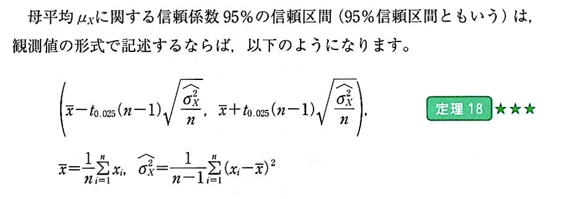
# p117

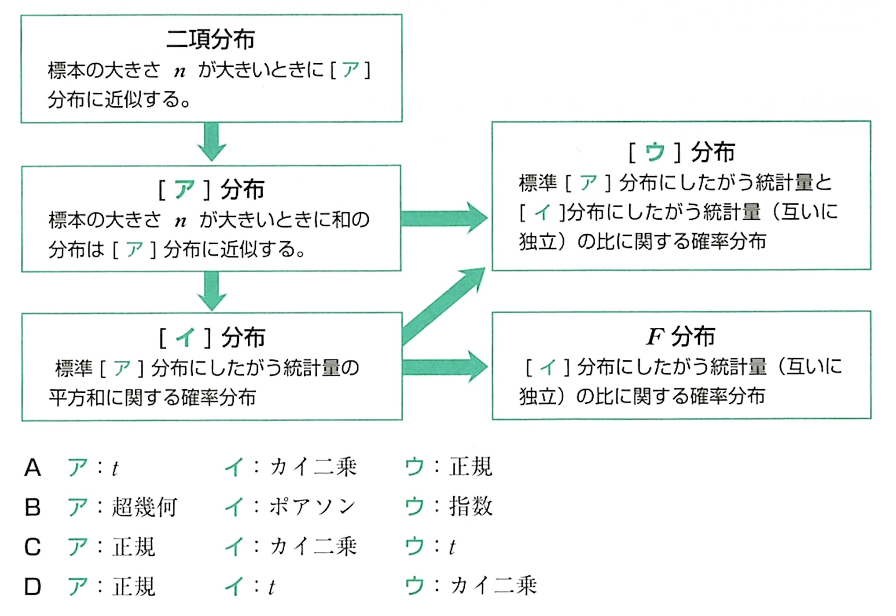

#

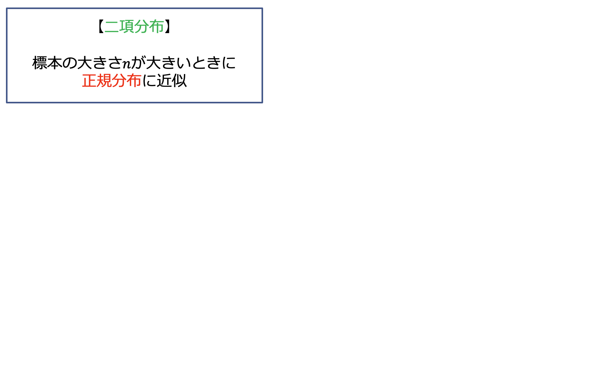

#

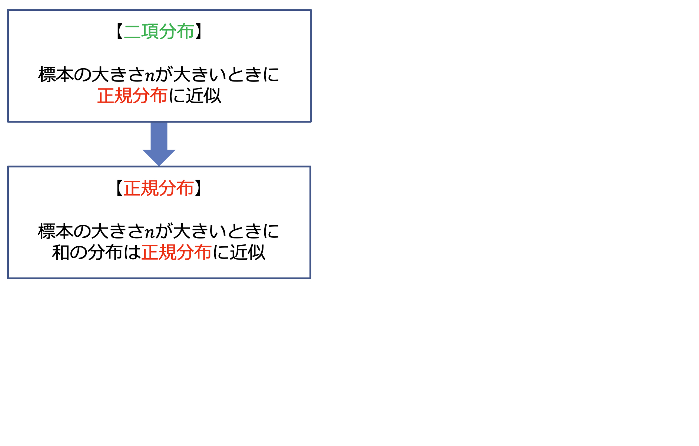

#

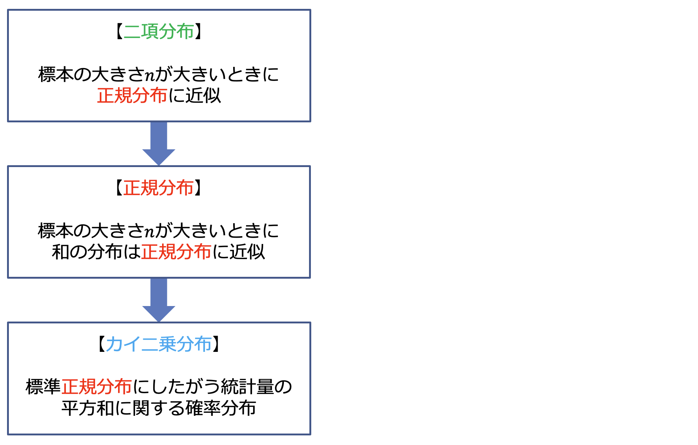

#

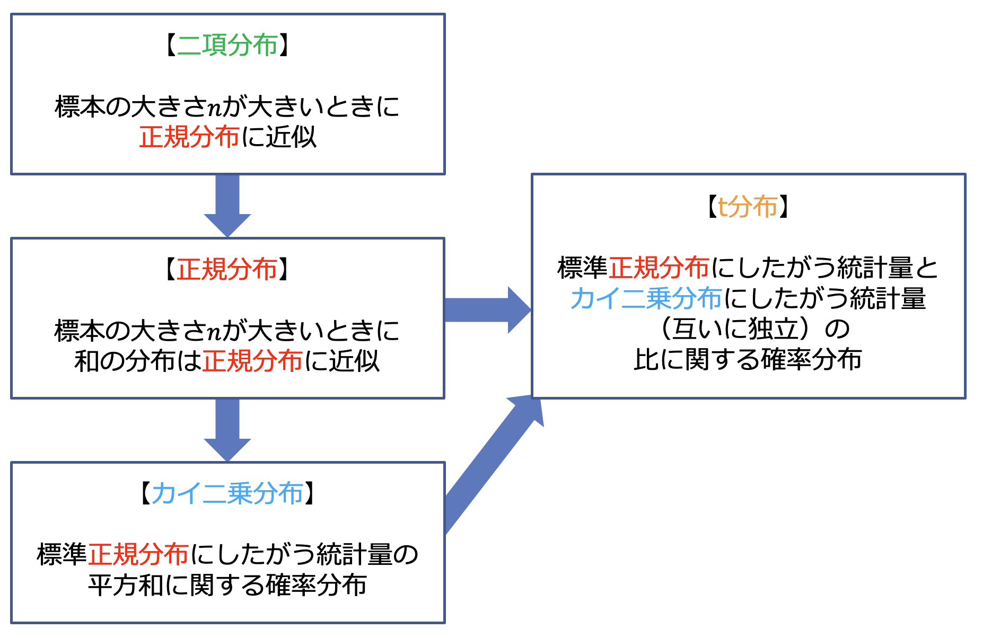

#

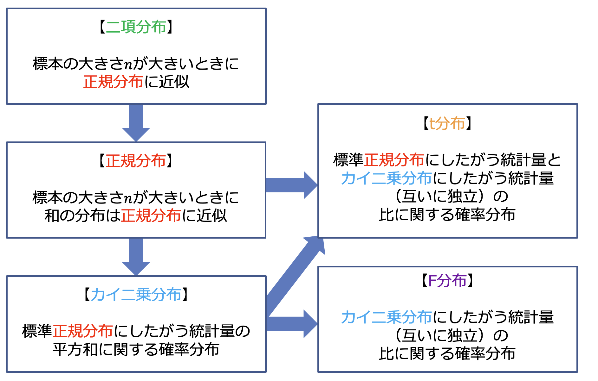

#

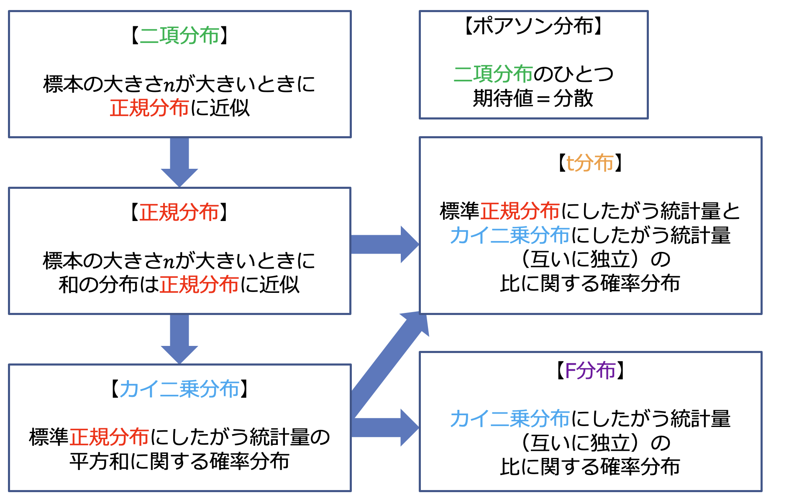

#

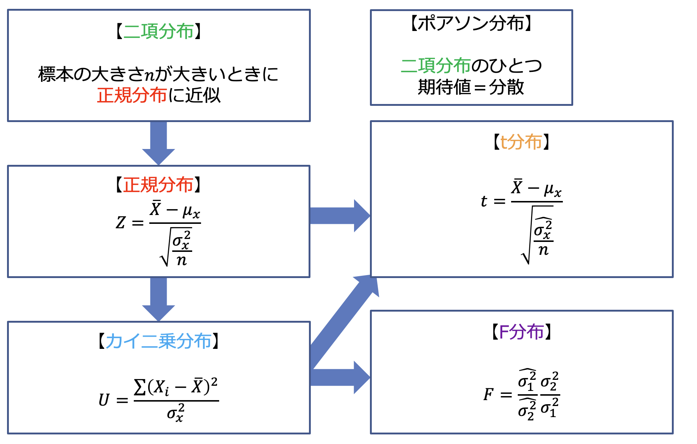

##

## 二項分布 binomial distribution

 
⬇︎

## ポアソン分布 poisson distribution

- ポアソン分布は、イベントがランダムで独立して特定の<medium><red>時間または空間</red></medium>の間に発生する状況で一般的に使用されます。

## カイ二乗分布 chi-squared distribution

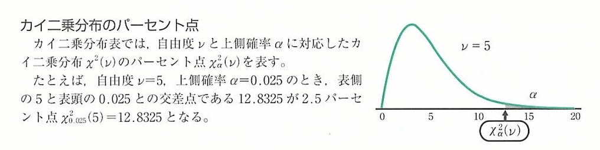

## t分布 student's t distribution

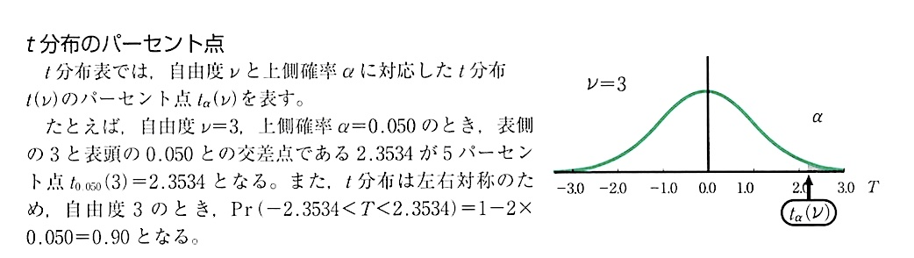

# Ch 9 母分散の区間推定

Confidence interval estimation for variance

Trying to estimate <medium>$\sigma^2$</medium> from <medium>$s^2$</medium>

## （復習）区間推定の考え方

- 区間推定
  - 推定量の確率分布における区間を用いて母数を推定
  - ある区間内に母数が含まれることを信頼度で示す

- 推定した区間
  - 信頼係数100(1−𝛼)%の信頼区間
    - <red>信頼係数</red>	confidence coefficient
    - <red>信頼区間</red>	conidence interval
  - 信頼係数95%の信頼区間のことを95%信頼区間ともいう
  - 信頼区間は（<red>下限値，上限値</red>）で表す

## （復讐）母平均の区間推定

## What is 分散？

 

## Let's see it in Python

##

しかし...標本分散の標本分布は正規*ではありません*

え？どういうこと？

##

なので、母分散の推定をする時に使う分布はt分布ではなく、
<xl>
カイ二乗分布を使う
</xl>

##

まず…母分散の区間推定に使う分布はカイ二乗分布...覚えてる？

##

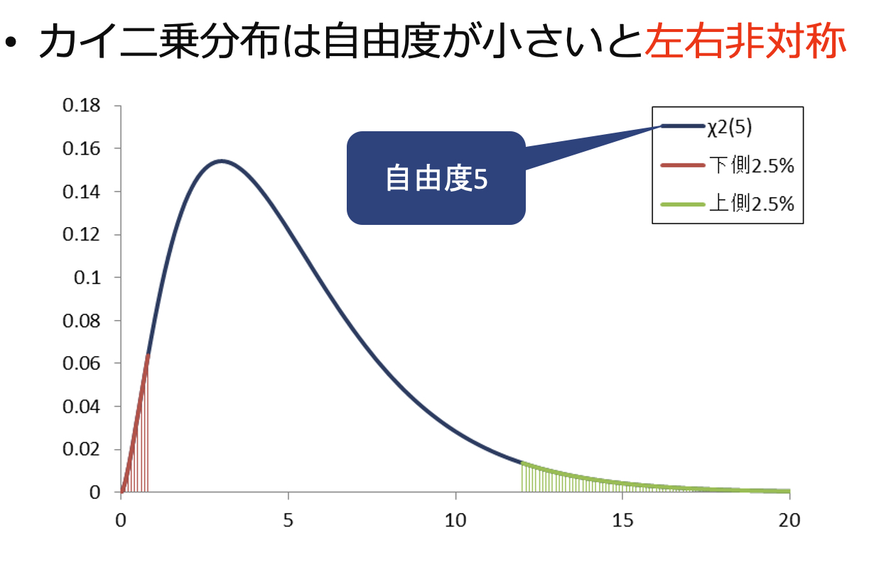

##

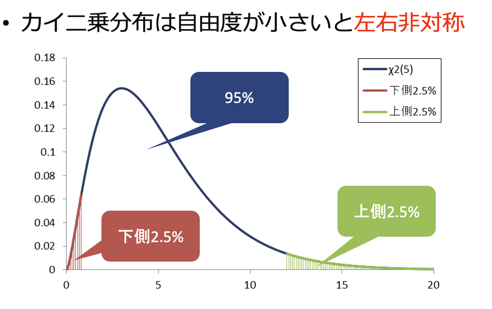

##

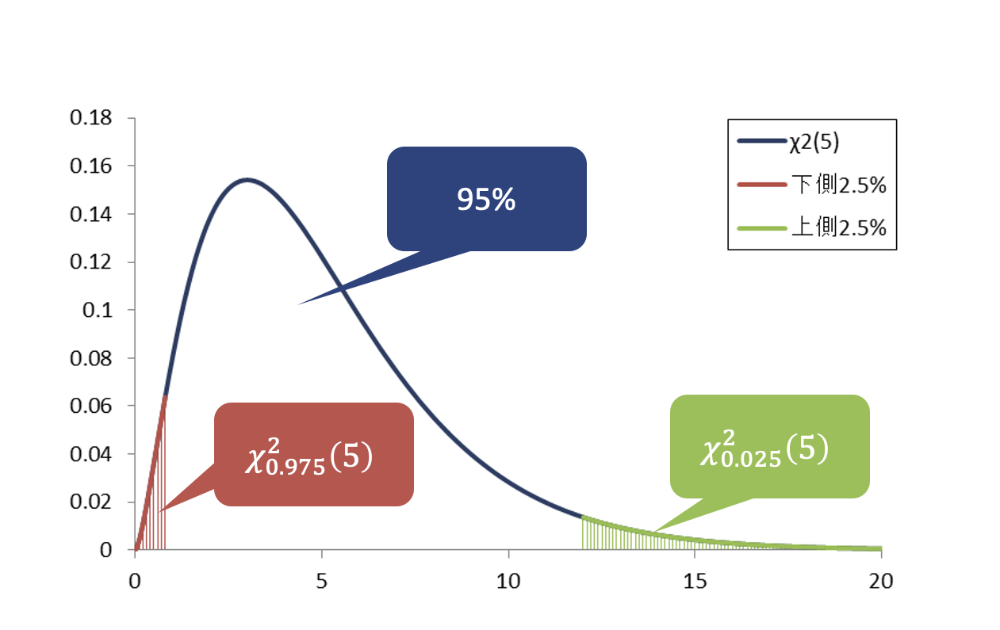

## p119

区間なのでで<red>下限値</red>と<red>上限値</red>を求める

<medium>

$Pr(\frac{\Sigma(x_i-\bar{x})^2}{x_{0.025}^2(n-1)}\lt\sigma_x^2\lt\frac{\Sigma(x_i-\bar{x})^2}{x_{0.975}^2(n-1)})=0.95$

⬇︎

$Pr(\frac{偏差平方和}{カイ二乗統計量0.025}\lt\sigma_x^2\lt\frac{偏差平方和}{カイ二乗統計量0.975})=0.95$

</medium>

## カイ二乗分布表をつかう

## カイ二乗分布表をつかう

## やってみよう

母分散の区間推定に必要なもの

①自由度：　$𝑛−1$

②カイ二乗統計量：　$統計表から読む$

③偏差平方和：　表を書いて計算（$(𝑥_𝑖−𝑥 ̅ )^2$を合計したもの）

### 例題10-1 p122

### 例題10-1 p122

### 例題10-1 p122

### 例題10-1 p122

## F分布 F Distribution

comparing two sample population variances

すなわち

$\sigma_1^2$と$\sigma_1^2$を比べる

##

## F分布

- カイ二乗分布にしたがう互いに独立な確率変数の比に関する確率分布
- 左右非対称

- 自由度が2つ$(𝜈_1, 𝜈_2 )$
- 分子の自由度が1つめ$（𝜈_1）$分母の自由度が2つめ$（𝜈_2）$

## F分布 p125

- カイ二乗分布にしたがう互いに独立な確率変数の比に関する確率分布
- 左右非対称
- 自由度が2つ$(𝜈_1, 𝜈_2 )$
- 分子の自由度が1つめ$（𝜈_1）$分母の自由度が2つめ$（𝜈_2）$

<medium>

$𝐹=\frac{\frac{𝑈_1}{𝜈_1}}{\frac{𝑈_2}{𝜈_2}}\sim 𝐹(𝜈_1, 𝜈_2 )$

</medium>

⬇︎

<medium>

$𝐹=\frac{\hat{\sigma_1^2}}{\sigma_2^2}\frac{\sigma_2^2}{\sigma_1^2}\sim 𝐹(n_1-1, n_2-1 )$

</medium>

## 実践してみよう

<small>*教科書とはアプローチは違うが、F検定でよく使われるメソッドを検定</small>

<gray>18歳の男子と女子の50メートル走のタイムの<red>ばらつき</red>に違いはありますか?</gray>

5% の有意水準で分散に違いがあるかどうかを結論付けることができますか。

<medium>

| 男子🏃🏻‍♂️ | 女子🏃🏻‍♀️ |
|-----|-------|
| $n_男=10$ $\bar{X}_男=7.51$ $s_男^2=0.3249$ | $n_女=15$ $\bar{X}_女=9.23$ $s_女^2=0.8464$ |

</medium>

##
| 男子🏃🏻‍♂️ | 女子🏃🏻‍♀️ |
|-----|-------|
| $n_男=10$ $\bar{X}_男=7.51$ $s_男^2=0.3249$ | $n_女=15$ $\bar{X}_女=9.23$ $s_女^2=0.8464$ |

<medium>

$F=\frac{s_女^2}{s_男^2}=\frac{0.8464}{0.3249}=2.605$

</medium>

##

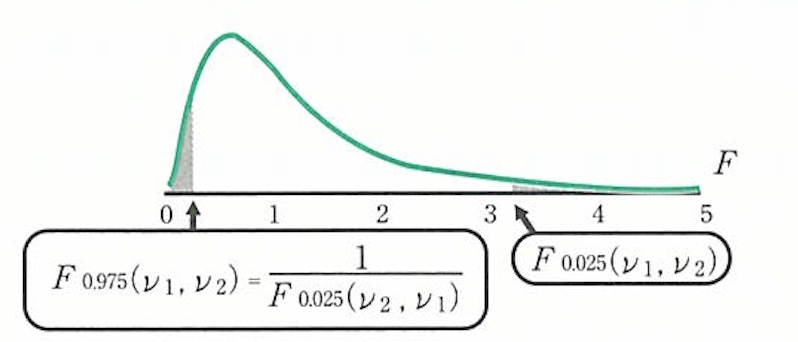
##

<medium>

$f_{0.025,14,9} = 3.209$

$\frac{1}{f_{0.09,5,14,9}} = \frac{1}{3.798}=0.2633$

##

すなわち

##

